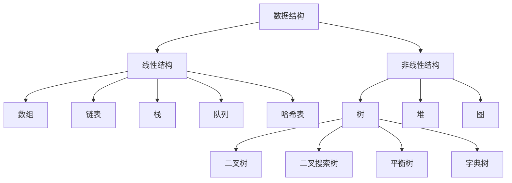

# 📚 LeetCode 常用数据结构与算法详解

> 🎯 一份面向开源社区的 LeetCode 数据结构与算法学习指南。本指南包含完整的学习路径、实战代码示例和丰富的参考资料，助你从算法小白成长为算法高手！

## 📋 快速导航

| 📖 内容 | 🎯 适用人群 | ⏱️ 预计时间 |
|---------|------------|-------------|
| [基础数据结构](#基础数据结构) | 初学者 | 2-3周 |
| [高级数据结构](#高级数据结构) | 有基础者 | 3-4周 |
| [字符串处理](#字符串处理) | 所有水平 | 1-2周 |
| [算法技巧](#算法技巧) | 进阶学习 | 4-6周 |
| [学习路径](#学习路径) | 规划学习 | 10分钟 |
| [参考资料](#参考资料) | 深入学习 | 持续参考 |

## 📚 目录

- [引言](#引言)
- [基础数据结构](#基础数据结构)
  - [数组 (Array)](#数组-array)
  - [链表 (Linked List)](#链表-linked-list)
  - [栈 (Stack)](#栈-stack)
  - [队列 (Queue)](#队列-queue)
  - [哈希表 (Hash Table)](#哈希表-hash-table)
- [高级数据结构](#高级数据结构)
  - [树 (Tree)](#树-tree)
  - [堆 (Heap)](#堆-heap)
  - [图 (Graph)](#图-graph)
- [字符串处理](#字符串处理)
  - [字符串 (String)](#字符串-string)
- [算法技巧](#算法技巧)
  - [双指针技巧](#双指针技巧)
  - [动态规划](#动态规划)
  - [回溯算法](#回溯算法)
  - [贪心算法](#贪心算法)
- [学习路径](#学习路径)
  - [初级阶段 (1-2个月)](#初级阶段-1-2个月)
  - [中级阶段 (2-3个月)](#中级阶段-2-3个月)
  - [高级阶段 (3-4个月)](#高级阶段-3-4个月)
  - [精通阶段 (持续学习)](#精通阶段-持续学习)
- [参考资料](#参考资料)
  - [推荐书籍](#推荐书籍)
  - [在线资源](#在线资源)
  - [视频课程](#视频课程)
  - [实用工具](#实用工具)
- [贡献指南](#贡献指南)
- [许可证](#许可证)
- [可视化图表](#可视化图表)
  - [数据结构关系图](#数据结构关系图)
  - [算法复杂度对比图](#算法复杂度对比图)
  - [双指针算法流程图](#双指针算法流程图)
  - [动态规划解题流程](#动态规划解题流程)
  - [回溯算法流程图](#回溯算法流程图)
  - [二分搜索流程图](#二分搜索流程图)
  - [BFS与DFS对比图](#bfs与dfs对比图)
  - [常见排序算法比较](#常见排序算法比较)
- [总结](#总结)
- [致谢](#致谢)

---

## 🚀 引言

欢迎来到 LeetCode 数据结构与算法的世界！无论你是准备面试的求职者，还是希望提升算法能力的开发者，本指南都能为你提供清晰的学习路径和实用的代码示例。

### 💡 为什么学习数据结构与算法？

- **🎯 面试必备**：数据结构与算法是技术面试的核心考察点，掌握它们能显著提高面试通过率
- **⚡ 提升代码质量**：掌握合适的数据结构能写出更高效的代码，优化程序性能
- **🧩 解决复杂问题**：算法思维帮助你分解和解决复杂问题，培养逻辑思维能力
- **📈 职业发展**：扎实的算法基础是高级工程师的必备技能，有助于职业晋升

### 🛠️ 如何使用本指南？

- **🌱 初学者**：按照[学习路径](#学习路径)循序渐进，先掌握基础数据结构
- **💼 有经验者**：直接查阅特定数据结构或算法，参考代码示例
- **🎓 面试准备**：重点关注 LeetCode 常见题型和解决方案，结合[参考资料](#参考资料)深入学习

### 🌟 本指南特色

- **📊 系统性学习路径**：从基础到高级，循序渐进
- **💻 实用代码示例**：每个数据结构和算法都配有详细的 Python 实现
- **🎯 LeetCode 专题**：针对面试常见题型提供解决方案
- **📚 丰富参考资料**：精选书籍、在线资源和实用工具
- **🔍 可视化图表**：通过图表直观理解复杂概念

---

> 💡 **小贴士**：建议先通读[学习路径](#学习路径)部分，了解整体学习规划，然后根据自己的基础选择合适的起点开始学习。记住，算法学习是一个循序渐进的过程，不要急于求成！

---

## 基础数据结构

### 数组 (Array)

#### 💡 核心概念

数组是一种线性数据结构，使用连续的内存空间存储相同类型的元素。在 Python 中，列表(list)就是动态数组的实现。

#### ⏱️ 时间复杂度分析

| 操作 | 时间复杂度 | 说明 |
|------|------------|------|
| 访问元素 | O(1) | 通过索引直接访问 |
| 修改元素 | O(1) | 通过索引直接修改 |
| 插入元素 | O(n) | 可能需要移动后续元素 |
| 删除元素 | O(n) | 可能需要移动后续元素 |
| 搜索元素 | O(n) | 需要遍历数组 |

#### 🎯 LeetCode 常见应用

```python
# 1. 双指针技巧 - 两数之和
def two_sum(nums, target):
    """
    两数之和 - 使用哈希表优化
    时间复杂度: O(n), 空间复杂度: O(n)
    LeetCode: 1. Two Sum
    """
    num_map = {}
    for i, num in enumerate(nums):
        complement = target - num
        if complement in num_map:
            return [num_map[complement], i]
        num_map[num] = i
    return []

# 2. 双指针技巧 - 删除排序数组中的重复项
def remove_duplicates(nums):
    """
    删除排序数组中的重复项
    时间复杂度: O(n), 空间复杂度: O(1)
    LeetCode: 26. Remove Duplicates from Sorted Array
    """
    if not nums:
        return 0
    
    slow = 0  # 慢指针指向不重复元素的最后一个位置
    for fast in range(1, len(nums)):  # 快指针遍历整个数组
        if nums[fast] != nums[slow]:  # 发现不重复元素
            slow += 1
            nums[slow] = nums[fast]  # 将不重复元素移到前面
    
    return slow + 1  # 返回不重复数组的长度

# 3. 滑动窗口 - 长度最小的子数组
def min_subarray_len(s, nums):
    """
    长度最小的子数组
    时间复杂度: O(n), 空间复杂度: O(1)
    LeetCode: 209. Minimum Size Subarray Sum
    """
    left = 0
    current_sum = 0
    min_len = float('inf')
    
    for right in range(len(nums)):
        current_sum += nums[right]
        # 当窗口内和大于等于目标值时，尝试缩小窗口
        while current_sum >= s:
            min_len = min(min_len, right - left + 1)
            current_sum -= nums[left]
            left += 1
    
    return min_len if min_len != float('inf') else 0

# 4. 螺旋矩阵
def spiral_order(matrix):
    """
    螺旋矩阵
    时间复杂度: O(m*n), 空间复杂度: O(1) (不计结果存储)
    LeetCode: 54. Spiral Matrix
    """
    if not matrix:
        return []
    
    result = []
    top, bottom = 0, len(matrix) - 1
    left, right = 0, len(matrix[0]) - 1
    
    while top <= bottom and left <= right:
        # 从左到右
        for i in range(left, right + 1):
            result.append(matrix[top][i])
        top += 1
        
        # 从上到下
        for i in range(top, bottom + 1):
            result.append(matrix[i][right])
        right -= 1
        
        if top <= bottom:
            # 从右到左
            for i in range(right, left - 1, -1):
                result.append(matrix[bottom][i])
            bottom -= 1
        
        if left <= right:
            # 从下到上
            for i in range(bottom, top - 1, -1):
                result.append(matrix[i][left])
            left += 1
    
    return result
```

#### 🔍 常见问题与技巧

- **原地操作**：利用双指针技巧实现原地修改数组，节省空间
- **边界处理**：注意数组为空、只有一个元素等边界情况
- **索引越界**：确保数组访问不会越界，特别是在循环中

#### 🛠️ 常用方法调用示例

```python
# 创建数组
arr = [1, 2, 3, 4, 5]
empty_arr = []
nested_arr = [[1, 2], [3, 4], [5, 6]]

# 访问元素
first_element = arr[0]          # 获取第一个元素: 1
last_element = arr[-1]          # 获取最后一个元素: 5
sub_array = arr[1:4]            # 获取子数组: [2, 3, 4]
step_array = arr[::2]           # 步长为2的切片: [1, 3, 5]

# 修改元素
arr[2] = 10                     # 修改索引为2的元素: [1, 2, 10, 4, 5]
arr[1:3] = [20, 30]             # 替换切片: [1, 20, 30, 4, 5]

# 添加元素
arr.append(6)                    # 在末尾添加元素: [1, 20, 30, 4, 5, 6]
arr.insert(2, 15)               # 在索引2处插入元素: [1, 20, 15, 30, 4, 5, 6]
arr.extend([7, 8])               # 扩展列表: [1, 20, 15, 30, 4, 5, 6, 7, 8]

# 删除元素
removed = arr.pop()              # 删除并返回最后一个元素: 8, 数组变为 [1, 20, 15, 30, 4, 5, 6, 7]
removed = arr.pop(2)             # 删除并返回索引2的元素: 15, 数组变为 [1, 20, 30, 4, 5, 6, 7]
arr.remove(30)                   # 删除第一个值为30的元素: [1, 20, 4, 5, 6, 7]
del arr[1:3]                     # 删除切片: [1, 5, 6, 7]

# 查找元素
index = arr.index(5)            # 查找元素5的索引: 1
count = arr.count(5)             # 统计元素5出现的次数: 1
is_present = 5 in arr            # 检查元素是否存在: True

# 排序
arr.sort()                       # 原地排序: [1, 5, 6, 7]
arr.sort(reverse=True)           # 降序排序: [7, 6, 5, 1]
sorted_arr = sorted(arr)         # 返回排序后的新数组: [1, 5, 6, 7]

# 反转
arr.reverse()                    # 原地反转: [1, 5, 6, 7]
reversed_arr = arr[::-1]         # 切片反转: [7, 6, 5, 1]

# 数组操作
arr1 = [1, 2, 3]
arr2 = [4, 5, 6]
combined = arr1 + arr2           # 数组连接: [1, 2, 3, 4, 5, 6]
repeated = arr1 * 3              # 数组重复: [1, 2, 3, 1, 2, 3, 1, 2, 3]

# 数组函数
length = len(arr)                # 数组长度: 4
max_val = max(arr)               # 最大值: 7
min_val = min(arr)               # 最小值: 1
total = sum(arr)                 # 求和: 19

# 数组转换
str_arr = list("hello")          # 字符串转数组: ['h', 'e', 'l', 'l', 'o']
num_str = "".join(map(str, arr)) # 数组转字符串: '1567'

# 列表推导式
squares = [x**2 for x in range(5)]  # [0, 1, 4, 9, 16]
evens = [x for x in arr if x % 2 == 0]  # [6]
nested_flat = [x for sublist in nested_arr for x in sublist]  # [1, 2, 3, 4, 5, 6]

# 二维数组操作
matrix = [[1, 2, 3], [4, 5, 6], [7, 8, 9]]
rows = len(matrix)               # 行数: 3
cols = len(matrix[0])            # 列数: 3
diagonal = [matrix[i][i] for i in range(min(rows, cols))]  # 对角线元素: [1, 5, 9]
transpose = [[matrix[j][i] for j in range(rows)] for i in range(cols)]  # 转置矩阵

# 数组复制
shallow_copy = arr.copy()        # 浅拷贝
deep_copy = arr[:]               # 浅拷贝
import copy
deep_copy2 = copy.deepcopy(arr)  # 深拷贝

# 数组清空
arr.clear()                      # 清空数组: []
```

---

### 链表 (Linked List)

#### 💡 核心概念

链表是由节点组成的线性数据结构，每个节点包含数据和指向下一个节点的指针。与数组不同，链表的元素在内存中不连续。

#### ⏱️ 时间复杂度分析

| 操作 | 时间复杂度 | 说明 |
|------|------------|------|
| 访问元素 | O(n) | 需要从头节点遍历 |
| 修改元素 | O(n) | 需要先找到元素 |
| 插入元素 | O(1) | 如果已有指针 |
| 删除元素 | O(1) | 如果已有指针 |
| 搜索元素 | O(n) | 需要遍历链表 |

#### 🎯 LeetCode 常见应用

```python
# 链表节点定义
class ListNode:
    """链表节点定义"""
    def __init__(self, val=0, next=None):
        self.val = val
        self.next = next

# 1. 反转链表
def reverse_list(head):
    """
    反转链表
    时间复杂度: O(n), 空间复杂度: O(1)
    LeetCode: 206. Reverse Linked List
    """
    prev = None
    current = head
    
    while current:
        next_node = current.next  # 保存下一个节点
        current.next = prev       # 反转当前节点的指针
        prev = current            # 移动prev指针
        current = next_node       # 移动current指针
    
    return prev  # prev是新的头节点

# 2. 合并两个有序链表
def merge_two_lists(l1, l2):
    """
    合并两个有序链表
    时间复杂度: O(m+n), 空间复杂度: O(1)
    LeetCode: 21. Merge Two Sorted Lists
    """
    dummy = ListNode(0)  # 哨兵节点，简化边界处理
    current = dummy
    
    while l1 and l2:
        if l1.val <= l2.val:
            current.next = l1
            l1 = l1.next
        else:
            current.next = l2
            l2 = l2.next
        current = current.next
    
    # 连接剩余部分
    current.next = l1 if l1 else l2
    return dummy.next

# 3. 环形链表检测
def has_cycle(head):
    """
    检测链表是否有环
    时间复杂度: O(n), 空间复杂度: O(1)
    LeetCode: 141. Linked List Cycle
    """
    if not head or not head.next:
        return False
    
    slow = head      # 慢指针，每次走一步
    fast = head.next # 快指针，每次走两步
    
    while slow != fast:
        if not fast or not fast.next:
            return False
        slow = slow.next
        fast = fast.next.next
    
    return True

# 4. 找到环形链表的入口节点
def detect_cycle(head):
    """
    找到环形链表的入口节点
    时间复杂度: O(n), 空间复杂度: O(1)
    LeetCode: 142. Linked List Cycle II
    """
    if not head or not head.next:
        return None
    
    # 检测是否有环
    slow = head
    fast = head.next
    
    while slow != fast:
        if not fast or not fast.next:
            return None
        slow = slow.next
        fast = fast.next.next
    
    # 找到环的入口
    slow = head
    fast = fast.next
    
    while slow != fast:
        slow = slow.next
        fast = fast.next
    
    return slow
```

#### 🔍 常见问题与技巧

- **哨兵节点**：使用哑节点简化头节点处理逻辑
- **快慢指针**：用于检测环、找中间节点等
- **递归与迭代**：链表问题通常可以用递归或迭代两种方式解决
- **内存管理**：注意处理节点引用，避免内存泄漏

#### 🛠️ 常用方法调用示例

```python
# 链表节点定义
class ListNode:
    """链表节点定义"""
    def __init__(self, val=0, next=None):
        self.val = val
        self.next = next

# 创建链表
def create_linked_list(values):
    """根据值列表创建链表"""
    if not values:
        return None
    
    head = ListNode(values[0])
    current = head
    
    for val in values[1:]:
        current.next = ListNode(val)
        current = current.next
    
    return head

# 遍历链表
def traverse_linked_list(head):
    """遍历链表并返回值列表"""
    values = []
    current = head
    
    while current:
        values.append(current.val)
        current = current.next
    
    return values

# 在链表头部插入节点
def insert_at_head(head, val):
    """在链表头部插入节点"""
    new_node = ListNode(val, head)
    return new_node

# 在链表尾部插入节点
def insert_at_tail(head, val):
    """在链表尾部插入节点"""
    new_node = ListNode(val)
    
    if not head:
        return new_node
    
    current = head
    while current.next:
        current = current.next
    
    current.next = new_node
    return head

# 在指定位置插入节点
def insert_at_position(head, val, position):
    """在指定位置插入节点"""
    if position == 0:
        return insert_at_head(head, val)
    
    new_node = ListNode(val)
    current = head
    
    # 找到插入位置的前一个节点
    for _ in range(position - 1):
        if not current:
            return head  # 位置超出链表长度
        current = current.next
    
    if current:
        new_node.next = current.next
        current.next = new_node
    
    return head

# 删除指定值的节点
def delete_by_value(head, val):
    """删除第一个值为val的节点"""
    if not head:
        return None
    
    # 如果要删除的是头节点
    if head.val == val:
        return head.next
    
    current = head
    while current.next and current.next.val != val:
        current = current.next
    
    if current.next:
        current.next = current.next.next
    
    return head

# 删除指定位置的节点
def delete_at_position(head, position):
    """删除指定位置的节点"""
    if not head:
        return None
    
    if position == 0:
        return head.next
    
    current = head
    
    # 找到要删除节点的前一个节点
    for _ in range(position - 1):
        if not current.next:
            return head  # 位置超出链表长度
        current = current.next
    
    if current.next:
        current.next = current.next.next
    
    return head

# 查找节点
def find_node(head, val):
    """查找值为val的节点，返回节点引用"""
    current = head
    
    while current:
        if current.val == val:
            return current
        current = current.next
    
    return None

# 获取链表长度
def get_length(head):
    """获取链表长度"""
    length = 0
    current = head
    
    while current:
        length += 1
        current = current.next
    
    return length

# 获取链表中间节点
def get_middle_node(head):
    """获取链表中间节点（使用快慢指针）"""
    if not head:
        return None
    
    slow = head
    fast = head
    
    while fast.next and fast.next.next:
        slow = slow.next
        fast = fast.next.next
    
    return slow

# 反转链表
def reverse_linked_list(head):
    """反转链表"""
    prev = None
    current = head
    
    while current:
        next_node = current.next
        current.next = prev
        prev = current
        current = next_node
    
    return prev

# 合并两个有序链表
def merge_sorted_lists(l1, l2):
    """合并两个有序链表"""
    dummy = ListNode(0)
    current = dummy
    
    while l1 and l2:
        if l1.val <= l2.val:
            current.next = l1
            l1 = l1.next
        else:
            current.next = l2
            l2 = l2.next
        current = current.next
    
    current.next = l1 if l1 else l2
    return dummy.next

# 检测链表是否有环
def has_cycle(head):
    """检测链表是否有环"""
    if not head or not head.next:
        return False
    
    slow = head
    fast = head.next
    
    while slow != fast:
        if not fast or not fast.next:
            return False
        slow = slow.next
        fast = fast.next.next
    
    return True

# 创建带环的链表（用于测试）
def create_cyclic_list(values, cycle_pos):
    """创建带环的链表，cycle_pos表示环的起始位置"""
    if not values:
        return None
    
    head = ListNode(values[0])
    current = head
    cycle_node = None
    
    for i in range(1, len(values)):
        current.next = ListNode(values[i])
        current = current.next
        
        if i == cycle_pos:
            cycle_node = current
    
    # 如果cycle_pos为0，则头节点是环的起始节点
    if cycle_pos == 0:
        cycle_node = head
    
    # 创建环
    if cycle_node:
        current.next = cycle_node
    
    return head

# 示例使用
if __name__ == "__main__":
    # 创建链表
    values = [1, 2, 3, 4, 5]
    head = create_linked_list(values)
    print("原始链表:", traverse_linked_list(head))  # [1, 2, 3, 4, 5]
    
    # 在头部插入
    head = insert_at_head(head, 0)
    print("头部插入后:", traverse_linked_list(head))  # [0, 1, 2, 3, 4, 5]
    
    # 在尾部插入
    head = insert_at_tail(head, 6)
    print("尾部插入后:", traverse_linked_list(head))  # [0, 1, 2, 3, 4, 5, 6]
    
    # 在指定位置插入
    head = insert_at_position(head, 99, 3)
    print("位置3插入后:", traverse_linked_list(head))  # [0, 1, 2, 99, 3, 4, 5, 6]
    
    # 删除指定值的节点
    head = delete_by_value(head, 99)
    print("删除99后:", traverse_linked_list(head))  # [0, 1, 2, 3, 4, 5, 6]
    
    # 删除指定位置的节点
    head = delete_at_position(head, 0)
    print("删除位置0后:", traverse_linked_list(head))  # [1, 2, 3, 4, 5, 6]
    
    # 查找节点
    node = find_node(head, 3)
    print("查找3:", node.val if node else "未找到")  # 3
    
    # 获取链表长度
    length = get_length(head)
    print("链表长度:", length)  # 6
    
    # 获取中间节点
    middle = get_middle_node(head)
    print("中间节点:", middle.val if middle else "未找到")  # 3
    
    # 反转链表
    head = reverse_linked_list(head)
    print("反转后:", traverse_linked_list(head))  # [6, 5, 4, 3, 2, 1]
    
    # 创建另一个有序链表
    values2 = [2, 4, 6, 8]
    head2 = create_linked_list(values2)
    
    # 合并两个有序链表
    merged = merge_sorted_lists(head, head2)
    print("合并后:", traverse_linked_list(merged))  # [1, 2, 2, 3, 4, 4, 5, 6, 6, 8]
    
    # 检测环
    cyclic_head = create_cyclic_list([1, 2, 3, 4], 1)  # 在位置1创建环
    print("是否有环:", has_cycle(cyclic_head))  # True
```

---

### 栈 (Stack)

#### 💡 核心概念

栈是一种后进先出(LIFO)的数据结构。在 Python 中，可以使用列表(list)或 collections.deque 实现栈。

#### ⏱️ 时间复杂度分析

| 操作 | 时间复杂度 | 说明 |
|------|------------|------|
| 入栈(push) | O(1) | 在栈顶添加元素 |
| 出栈(pop) | O(1) | 从栈顶移除元素 |
| 查看栈顶元素 | O(1) | 获取栈顶元素但不移除 |
| 判断栈是否为空 | O(1) | 检查栈是否为空 |

#### 🎯 LeetCode 常见应用

```python
# 1. 有效的括号
def is_valid_parentheses(s):
    """
    有效的括号
    时间复杂度: O(n), 空间复杂度: O(n)
    LeetCode: 20. Valid Parentheses
    """
    stack = []
    mapping = {')': '(', '}': '{', ']': '['}
    
    for char in s:
        if char in mapping:  # 右括号
            top_element = stack.pop() if stack else '#'
            if mapping[char] != top_element:
                return False
        else:  # 左括号
            stack.append(char)
    
    return not stack

# 2. 最小栈
class MinStack:
    """
    最小栈 - 支持在O(1)时间内获取栈中最小元素
    时间复杂度: O(1), 空间复杂度: O(n)
    LeetCode: 155. Min Stack
    """
    def __init__(self):
        self.stack = []      # 主栈，存储所有元素
        self.min_stack = []  # 辅助栈，存储当前最小值
    
    def push(self, val):
        self.stack.append(val)
        # 如果当前值小于等于最小栈顶元素，则压入最小栈
        if not self.min_stack or val <= self.min_stack[-1]:
            self.min_stack.append(val)
    
    def pop(self):
        # 如果弹出的元素等于最小栈顶元素，则同时弹出最小栈顶元素
        if self.stack.pop() == self.min_stack[-1]:
            self.min_stack.pop()
    
    def top(self):
        return self.stack[-1]
    
    def get_min(self):
        return self.min_stack[-1]

# 3. 逆波兰表达式求值
def eval_rpn(tokens):
    """
    逆波兰表达式求值
    时间复杂度: O(n), 空间复杂度: O(n)
    LeetCode: 150. Evaluate Reverse Polish Notation
    """
    stack = []
    
    for token in tokens:
        if token in "+-*/":
            b = stack.pop()
            a = stack.pop()
            if token == '+':
                stack.append(a + b)
            elif token == '-':
                stack.append(a - b)
            elif token == '*':
                stack.append(a * b)
            elif token == '/':
                stack.append(int(a / b))  # 向零截断
        else:
            stack.append(int(token))
    
    return stack[0]

# 4. 柱状图中最大的矩形
def largest_rectangle_area(heights):
    """
    柱状图中最大的矩形 - 单调栈应用
    时间复杂度: O(n), 空间复杂度: O(n)
    LeetCode: 84. Largest Rectangle in Histogram
    """
    stack = [-1]  # 存储索引，-1作为哨兵
    max_area = 0
    
    for i in range(len(heights)):
        # 当前高度小于栈顶高度时，计算面积
        while stack[-1] != -1 and heights[i] < heights[stack[-1]]:
            height = heights[stack.pop()]
            width = i - stack[-1] - 1  # 宽度为当前索引减去新栈顶索引再减1
            max_area = max(max_area, height * width)
        stack.append(i)
    
    # 处理栈中剩余元素
    while stack[-1] != -1:
        height = heights[stack.pop()]
        width = len(heights) - stack[-1] - 1
        max_area = max(max_area, height * width)
    
    return max_area
```

#### 🔍 常见问题与技巧

- **单调栈**：维护栈内元素的单调性，解决区间最值问题
- **辅助栈**：使用额外栈存储辅助信息，如最小值、最大值等
- **递归与栈**：递归本质上是使用系统栈，可以显式使用栈模拟递归过程

#### 🛠️ 常用方法调用示例

```python
# 基于列表的栈实现
class ListStack:
    """基于列表的栈实现"""
    def __init__(self):
        self.items = []
    
    def is_empty(self):
        """检查栈是否为空"""
        return len(self.items) == 0
    
    def push(self, item):
        """入栈"""
        self.items.append(item)
    
    def pop(self):
        """出栈"""
        if self.is_empty():
            raise IndexError("pop from empty stack")
        return self.items.pop()
    
    def peek(self):
        """查看栈顶元素"""
        if self.is_empty():
            raise IndexError("peek from empty stack")
        return self.items[-1]
    
    def size(self):
        """获取栈大小"""
        return len(self.items)
    
    def __str__(self):
        return str(self.items)

# 基于collections.deque的栈实现（推荐）
from collections import deque

class DequeStack:
    """基于collections.deque的栈实现（推荐）"""
    def __init__(self):
        self.items = deque()
    
    def is_empty(self):
        """检查栈是否为空"""
        return len(self.items) == 0
    
    def push(self, item):
        """入栈"""
        self.items.append(item)
    
    def pop(self):
        """出栈"""
        if self.is_empty():
            raise IndexError("pop from empty stack")
        return self.items.pop()
    
    def peek(self):
        """查看栈顶元素"""
        if self.is_empty():
            raise IndexError("peek from empty stack")
        return self.items[-1]
    
    def size(self):
        """获取栈大小"""
        return len(self.items)
    
    def __str__(self):
        return str(list(self.items))

# 栈的应用示例

# 1. 括号匹配
def check_brackets(expression):
    """检查表达式中的括号是否匹配"""
    stack = DequeStack()
    brackets = {'(': ')', '[': ']', '{': '}'}
    
    for char in expression:
        if char in brackets.keys():  # 左括号
            stack.push(char)
        elif char in brackets.values():  # 右括号
            if stack.is_empty():
                return False
            
            left_bracket = stack.pop()
            if brackets[left_bracket] != char:
                return False
    
    return stack.is_empty()

# 2. 中缀表达式转后缀表达式
def infix_to_postfix(expression):
    """中缀表达式转后缀表达式"""
    precedence = {'+': 1, '-': 1, '*': 2, '/': 2, '^': 3}
    stack = DequeStack()
    output = []
    
    for char in expression:
        if char.isalnum():  # 操作数
            output.append(char)
        elif char == '(':  # 左括号
            stack.push(char)
        elif char == ')':  # 右括号
            while not stack.is_empty() and stack.peek() != '(':
                output.append(stack.pop())
            stack.pop()  # 弹出左括号
        else:  # 操作符
            while (not stack.is_empty() and stack.peek() != '(' and
                   precedence.get(stack.peek(), 0) >= precedence.get(char, 0)):
                output.append(stack.pop())
            stack.push(char)
    
    # 弹出栈中剩余的操作符
    while not stack.is_empty():
        output.append(stack.pop())
    
    return ''.join(output)

# 3. 计算后缀表达式
def evaluate_postfix(expression):
    """计算后缀表达式"""
    stack = DequeStack()
    
    for char in expression:
        if char.isdigit():  # 操作数
            stack.push(int(char))
        else:  # 操作符
            operand2 = stack.pop()
            operand1 = stack.pop()
            
            if char == '+':
                result = operand1 + operand2
            elif char == '-':
                result = operand1 - operand2
            elif char == '*':
                result = operand1 * operand2
            elif char == '/':
                result = operand1 / operand2
            elif char == '^':
                result = operand1 ** operand2
            
            stack.push(result)
    
    return stack.pop()

# 4. 栈排序
def sort_stack(stack):
    """使用一个辅助栈对原栈进行排序（从栈底到栈顶递增）"""
    temp_stack = DequeStack()
    
    while not stack.is_empty():
        # 将原栈的元素弹出
        temp = stack.pop()
        
        # 将辅助栈中比当前元素大的元素移回原栈
        while not temp_stack.is_empty() and temp_stack.peek() > temp:
            stack.push(temp_stack.pop())
        
        # 将当前元素压入辅助栈
        temp_stack.push(temp)
    
    # 将辅助栈中的元素移回原栈
    while not temp_stack.is_empty():
        stack.push(temp_stack.pop())
    
    return stack

# 5. 删除栈中所有特定元素
def remove_elements(stack, value):
    """删除栈中所有值为value的元素"""
    temp_stack = DequeStack()
    
    # 将所有不是value的元素移到临时栈
    while not stack.is_empty():
        item = stack.pop()
        if item != value:
            temp_stack.push(item)
    
    # 将元素移回原栈
    while not temp_stack.is_empty():
        stack.push(temp_stack.pop())
    
    return stack

# 6. 反转栈
def reverse_stack(stack):
    """反转栈"""
    queue = deque()  # 使用队列作为辅助
    
    # 将栈中元素移到队列
    while not stack.is_empty():
        queue.append(stack.pop())
    
    # 将队列中元素移回栈
    while queue:
        stack.push(queue.popleft())
    
    return stack

# 示例使用
if __name__ == "__main__":
    # 创建栈
    stack = DequeStack()
    print("栈是否为空:", stack.is_empty())  # True
    
    # 入栈操作
    stack.push(1)
    stack.push(2)
    stack.push(3)
    print("栈内容:", stack)  # [1, 2, 3]
    print("栈大小:", stack.size())  # 3
    print("栈顶元素:", stack.peek())  # 3
    
    # 出栈操作
    item = stack.pop()
    print("出栈元素:", item)  # 3
    print("栈内容:", stack)  # [1, 2]
    
    # 括号匹配
    expression = "{[()()]}"
    print("括号是否匹配:", check_brackets(expression))  # True
    
    # 中缀转后缀
    infix = "a+b*(c^d-e)^(f+g*h)-i"
    postfix = infix_to_postfix(infix)
    print("中缀表达式:", infix)
    print("后缀表达式:", postfix)  # abcd^e-fgh*+^*+i-
    
    # 计算后缀表达式
    postfix_expr = "231*+9-"
    result = evaluate_postfix(postfix_expr)
    print("后缀表达式 {} 的计算结果:".format(postfix_expr), result)  # -4
    
    # 栈排序
    unsorted_stack = DequeStack()
    for num in [3, 1, 4, 2, 5]:
        unsorted_stack.push(num)
    print("排序前:", unsorted_stack)  # [3, 1, 4, 2, 5]
    sorted_stack = sort_stack(unsorted_stack)
    print("排序后:", sorted_stack)  # [5, 4, 3, 2, 1]
    
    # 删除特定元素
    stack_with_duplicates = DequeStack()
    for num in [1, 2, 3, 2, 4, 2, 5]:
        stack_with_duplicates.push(num)
    print("删除前:", stack_with_duplicates)  # [1, 2, 3, 2, 4, 2, 5]
    cleaned_stack = remove_elements(stack_with_duplicates, 2)
    print("删除2后:", cleaned_stack)  # [1, 3, 4, 5]
    
    # 反转栈
    stack_to_reverse = DequeStack()
    for num in [1, 2, 3, 4, 5]:
        stack_to_reverse.push(num)
    print("反转前:", stack_to_reverse)  # [1, 2, 3, 4, 5]
    reversed_stack = reverse_stack(stack_to_reverse)
    print("反转后:", reversed_stack)  # [5, 4, 3, 2, 1]
```

---

### 队列 (Queue)

#### 💡 核心概念

队列是一种先进先出(FIFO)的数据结构。在 Python 中，可以使用 collections.deque 实现高效的队列。

#### ⏱️ 时间复杂度分析

| 操作 | 时间复杂度 | 说明 |
|------|------------|------|
| 入队(enqueue) | O(1) | 在队尾添加元素 |
| 出队(dequeue) | O(1) | 从队首移除元素 |
| 查看队首元素 | O(1) | 获取队首元素但不移除 |
| 判断队列是否为空 | O(1) | 检查队列是否为空 |

#### 🎯 LeetCode 常见应用

```python
from collections import deque

# 1. 二叉树的层序遍历
def level_order(root):
    """
    二叉树的层序遍历
    时间复杂度: O(n), 空间复杂度: O(n)
    LeetCode: 102. Binary Tree Level Order Traversal
    """
    if not root:
        return []
    
    result = []
    queue = deque([root])
    
    while queue:
        level_size = len(queue)  # 当前层的节点数
        current_level = []
        
        for _ in range(level_size):
            node = queue.popleft()
            current_level.append(node.val)
            
            if node.left:
                queue.append(node.left)
            if node.right:
                queue.append(node.right)
        
        result.append(current_level)
    
    return result

# 2. 滑动窗口最大值
def max_sliding_window(nums, k):
    """
    滑动窗口最大值 - 单调队列应用
    时间复杂度: O(n), 空间复杂度: O(k)
    LeetCode: 239. Sliding Window Maximum
    """
    if not nums or k == 0:
        return []
    
    deque_window = deque()  # 存储索引，保持队列内元素值递减
    result = []
    
    for i in range(len(nums)):
        # 移除窗口外的索引
        while deque_window and deque_window[0] < i - k + 1:
            deque_window.popleft()
        
        # 移除比当前元素小的索引
        while deque_window and nums[deque_window[-1]] < nums[i]:
            deque_window.pop()
        
        deque_window.append(i)
        
        # 窗口形成后，记录最大值
        if i >= k - 1:
            result.append(nums[deque_window[0]])
    
    return result

# 3. 完全平方数
def num_squares(n):
    """
    完全平方数 - BFS应用
    时间复杂度: O(n*sqrt(n)), 空间复杂度: O(n)
    LeetCode: 279. Perfect Squares
    """
    if n <= 0:
        return 0
    
    # 生成所有可能的完全平方数
    squares = []
    i = 1
    while i * i <= n:
        squares.append(i * i)
        i += 1
    
    # BFS
    level = 0
    queue = deque([n])
    visited = set([n])
    
    while queue:
        level += 1
        size = len(queue)
        
        for _ in range(size):
            remainder = queue.popleft()
            
            for square in squares:
                if remainder == square:
                    return level
                
                if remainder < square:
                    break
                
                if remainder - square not in visited:
                    visited.add(remainder - square)
                    queue.append(remainder - square)
    
    return level
```

#### 🔍 常见问题与技巧

- **单调队列**：维护队列内元素的单调性，解决滑动窗口最值问题
- **BFS与队列**：队列是BFS算法的核心数据结构
- **双端队列**：deque可以在两端高效操作，适用于更复杂的场景

#### 🛠️ 常用方法调用示例

```python
from collections import deque
import queue
import threading
import time

# 基于collections.deque的队列实现（推荐）
class DequeQueue:
    """基于collections.deque的队列实现（推荐）"""
    def __init__(self):
        self.items = deque()
    
    def is_empty(self):
        """检查队列是否为空"""
        return len(self.items) == 0
    
    def enqueue(self, item):
        """入队"""
        self.items.append(item)
    
    def dequeue(self):
        """出队"""
        if self.is_empty():
            raise IndexError("dequeue from empty queue")
        return self.items.popleft()
    
    def peek(self):
        """查看队首元素"""
        if self.is_empty():
            raise IndexError("peek from empty queue")
        return self.items[0]
    
    def size(self):
        """获取队列大小"""
        return len(self.items)
    
    def __str__(self):
        return str(list(self.items))

# 基于queue.Queue的线程安全队列
class ThreadSafeQueue:
    """基于queue.Queue的线程安全队列"""
    def __init__(self, maxsize=0):
        self.queue = queue.Queue(maxsize)
    
    def is_empty(self):
        """检查队列是否为空"""
        return self.queue.empty()
    
    def enqueue(self, item, block=True, timeout=None):
        """入队"""
        self.queue.put(item, block=block, timeout=timeout)
    
    def dequeue(self, block=True, timeout=None):
        """出队"""
        return self.queue.get(block=block, timeout=timeout)
    
    def peek(self):
        """查看队首元素（非阻塞）"""
        try:
            return self.queue.queue[0]
        except IndexError:
            raise IndexError("peek from empty queue")
    
    def size(self):
        """获取队列大小"""
        return self.queue.qsize()
    
    def task_done(self):
        """标记任务完成"""
        self.queue.task_done()
    
    def join(self):
        """等待所有任务完成"""
        self.queue.join()
    
    def __str__(self):
        return str(list(self.queue.queue))

# 基于列表的队列实现（不推荐，出队操作效率低）
class ListQueue:
    """基于列表的队列实现（不推荐，出队操作效率低）"""
    def __init__(self):
        self.items = []
    
    def is_empty(self):
        """检查队列是否为空"""
        return len(self.items) == 0
    
    def enqueue(self, item):
        """入队"""
        self.items.append(item)
    
    def dequeue(self):
        """出队"""
        if self.is_empty():
            raise IndexError("dequeue from empty queue")
        return self.items.pop(0)  # O(n)操作，效率低
    
    def peek(self):
        """查看队首元素"""
        if self.is_empty():
            raise IndexError("peek from empty queue")
        return self.items[0]
    
    def size(self):
        """获取队列大小"""
        return len(self.items)
    
    def __str__(self):
        return str(self.items)

# 循环队列实现
class CircularQueue:
    """循环队列实现"""
    def __init__(self, capacity):
        self.capacity = capacity
        self.items = [None] * capacity
        self.front = 0
        self.rear = 0
        self.count = 0
    
    def is_empty(self):
        """检查队列是否为空"""
        return self.count == 0
    
    def is_full(self):
        """检查队列是否已满"""
        return self.count == self.capacity
    
    def enqueue(self, item):
        """入队"""
        if self.is_full():
            raise Exception("Queue is full")
        
        self.items[self.rear] = item
        self.rear = (self.rear + 1) % self.capacity
        self.count += 1
    
    def dequeue(self):
        """出队"""
        if self.is_empty():
            raise Exception("Queue is empty")
        
        item = self.items[self.front]
        self.items[self.front] = None
        self.front = (self.front + 1) % self.capacity
        self.count -= 1
        return item
    
    def peek(self):
        """查看队首元素"""
        if self.is_empty():
            raise Exception("Queue is empty")
        return self.items[self.front]
    
    def size(self):
        """获取队列大小"""
        return self.count
    
    def __str__(self):
        if self.is_empty():
            return "[]"
        
        result = []
        index = self.front
        for _ in range(self.count):
            result.append(str(self.items[index]))
            index = (index + 1) % self.capacity
        
        return "[" + ", ".join(result) + "]"

# 队列的应用示例

# 1. 约瑟夫问题
def josephus_problem(n, k):
    """约瑟夫问题：n个人围成一圈，从第一个人开始报数，数到k的人出列"""
    q = DequeQueue()
    
    # 初始化队列
    for i in range(1, n + 1):
        q.enqueue(i)
    
    result = []
    while not q.is_empty():
        # 将前k-1个人移到队尾
        for _ in range(k - 1):
            q.enqueue(q.dequeue())
        
        # 第k个人出列
        result.append(q.dequeue())
    
    return result

# 2. 任务调度器
def task_scheduler(tasks, cooldown):
    """任务调度器：相同任务之间至少需要cooldown个时间单位"""
    from collections import defaultdict, deque
    
    task_count = defaultdict(int)
    for task in tasks:
        task_count[task] += 1
    
    # 按任务数量排序
    sorted_tasks = sorted(task_count.items(), key=lambda x: x[1], reverse=True)
    
    # 使用队列模拟时间线
    time = 0
    task_queue = deque()
    
    # 初始化任务队列
    for task, count in sorted_tasks:
        task_queue.append((task, count, 0))  # (任务, 剩余次数, 可执行时间)
    
    while task_queue:
        time += 1
        
        # 检查队首任务是否可以执行
        if task_queue[0][2] <= time:
            task, count, _ = task_queue.popleft()
            count -= 1
            
            if count > 0:
                # 任务还有剩余，加入队列尾部，设置冷却时间
                task_queue.append((task, count, time + cooldown))
    
    return time

# 3. 二叉树的层序遍历（使用队列）
class TreeNode:
    """二叉树节点定义"""
    def __init__(self, val=0, left=None, right=None):
        self.val = val
        self.left = left
        self.right = right

def level_order_traversal(root):
    """二叉树的层序遍历"""
    if not root:
        return []
    
    result = []
    q = DequeQueue()
    q.enqueue(root)
    
    while not q.is_empty():
        level_size = q.size()
        current_level = []
        
        for _ in range(level_size):
            node = q.dequeue()
            current_level.append(node.val)
            
            if node.left:
                q.enqueue(node.left)
            if node.right:
                q.enqueue(node.right)
        
        result.append(current_level)
    
    return result

# 4. 生产者-消费者模型
def producer_consumer_example():
    """生产者-消费者模型示例"""
    buffer = ThreadSafeQueue(maxsize=5)  # 缓冲区大小为5
    
    def producer():
        """生产者线程"""
        for i in range(10):
            item = f"Item-{i}"
            buffer.enqueue(item)
            print(f"生产: {item}")
            time.sleep(0.1)  # 模拟生产时间
    
    def consumer():
        """消费者线程"""
        for _ in range(10):
            item = buffer.dequeue()
            print(f"消费: {item}")
            time.sleep(0.2)  # 模拟消费时间
    
    # 创建并启动线程
    producer_thread = threading.Thread(target=producer)
    consumer_thread = threading.Thread(target=consumer)
    
    producer_thread.start()
    consumer_thread.start()
    
    # 等待线程完成
    producer_thread.join()
    consumer_thread.join()

# 5. 队列排序
def sort_queue(q):
    """使用递归对队列进行排序（升序）"""
    if q.is_empty():
        return q
    
    # 获取队首元素
    temp = q.dequeue()
    
    # 递归排序剩余队列
    sort_queue(q)
    
    # 将元素插入到正确位置
    insert_sorted(q, temp)
    return q

def insert_sorted(q, item):
    """将元素插入到已排序队列的正确位置"""
    # 如果队列为空或队首元素大于等于待插入元素，直接入队
    if q.is_empty() or q.peek() >= item:
        q.enqueue(item)
        return
    
    # 否则，递归处理
    temp = q.dequeue()
    insert_sorted(q, item)
    q.enqueue(temp)

# 6. 队列反转
def reverse_queue(q):
    """反转队列"""
    if q.is_empty():
        return q
    
    # 获取队首元素
    temp = q.dequeue()
    
    # 递归反转剩余队列
    reverse_queue(q)
    
    # 将元素入队
    q.enqueue(temp)
    return q

# 示例使用
if __name__ == "__main__":
    # 创建队列
    q = DequeQueue()
    print("队列是否为空:", q.is_empty())  # True
    
    # 入队操作
    q.enqueue(1)
    q.enqueue(2)
    q.enqueue(3)
    print("队列内容:", q)  # [1, 2, 3]
    print("队列大小:", q.size())  # 3
    print("队首元素:", q.peek())  # 1
    
    # 出队操作
    item = q.dequeue()
    print("出队元素:", item)  # 1
    print("队列内容:", q)  # [2, 3]
    
    # 约瑟夫问题
    result = josephus_problem(7, 3)
    print("约瑟夫问题结果:", result)  # [3, 6, 2, 7, 5, 1, 4]
    
    # 任务调度器
    tasks = ["A", "A", "A", "B", "B", "B"]
    min_time = task_scheduler(tasks, 2)
    print("任务调度最短时间:", min_time)  # 8
    
    # 二叉树层序遍历
    # 构建二叉树
    #       1
    #      / \
    #     2   3
    #    / \   \
    #   4   5   6
    root = TreeNode(1)
    root.left = TreeNode(2)
    root.right = TreeNode(3)
    root.left.left = TreeNode(4)
    root.left.right = TreeNode(5)
    root.right.right = TreeNode(6)
    
    traversal = level_order_traversal(root)
    print("二叉树层序遍历:", traversal)  # [[1], [2, 3], [4, 5, 6]]
    
    # 循环队列
    circular_q = CircularQueue(5)
    for i in range(1, 6):
        circular_q.enqueue(i)
    print("循环队列:", circular_q)  # [1, 2, 3, 4, 5]
    
    circular_q.dequeue()
    circular_q.dequeue()
    circular_q.enqueue(6)
    circular_q.enqueue(7)
    print("循环队列操作后:", circular_q)  # [3, 4, 5, 6, 7]
    
    # 队列排序
    unsorted_q = DequeQueue()
    for num in [3, 1, 4, 2, 5]:
        unsorted_q.enqueue(num)
    print("排序前:", unsorted_q)  # [3, 1, 4, 2, 5]
    sorted_q = sort_queue(unsorted_q)
    print("排序后:", sorted_q)  # [1, 2, 3, 4, 5]
    
    # 队列反转
    reverse_test_q = DequeQueue()
    for num in [1, 2, 3, 4, 5]:
        reverse_test_q.enqueue(num)
    print("反转前:", reverse_test_q)  # [1, 2, 3, 4, 5]
    reversed_q = reverse_queue(reverse_test_q)
    print("反转后:", reversed_q)  # [5, 4, 3, 2, 1]
```

---

### 哈希表 (Hash Table)

#### 💡 核心概念

哈希表是通过键(key)的哈希值来映射到存储位置的数据结构。在 Python 中，字典(dict)和集合(set)都是基于哈希表实现的。

#### ⏱️ 时间复杂度分析

| 操作 | 时间复杂度 | 说明 |
|------|------------|------|
| 插入元素 | 平均 O(1)，最坏 O(n) | 哈希冲突时可能退化为链表 |
| 删除元素 | 平均 O(1)，最坏 O(n) | 哈希冲突时可能退化为链表 |
| 查找元素 | 平均 O(1)，最坏 O(n) | 哈希冲突时可能退化为链表 |
| 获取所有键/值 | O(n) | 需要遍历整个哈希表 |

#### 🎯 LeetCode 常见应用

```python
# 1. 两数之和

## 问题描述

给定一个整数数组 `nums` 和一个整数目标值 `target`，请你在该数组中找出和为目标值 `target` 的那两个整数，并返回它们的数组下标。

你可以假设每种输入只会对应一个答案。但是，数组中同一个元素在答案里不能重复出现。

你可以按任意顺序返回答案。

**示例 1：**

```
输入：nums = [2,7,11,15], target = 9
输出：[0,1]
解释：因为 nums[0] + nums[1] == 9 ，返回 [0, 1]
```

**示例 2：**

```
输入：nums = [3,2,4], target = 6
输出：[1,2]
```

**示例 3：**

```
输入：nums = [3,3], target = 6
输出：[0,1]
```

**提示：**

- `2 <= nums.length <= 10^4`
- `-10^9 <= nums[i] <= 10^9`
- `-10^9 <= target <= 10^9`
- **只会存在一个有效答案**

def two_sum(nums, target):
    """
    两数之和
    时间复杂度: O(n), 空间复杂度: O(n)
    LeetCode: 1. Two Sum
    """
    num_map = {}
    
    for i, num in enumerate(nums):
        complement = target - num
        if complement in num_map:
            return [num_map[complement], i]
        num_map[num] = i
    
    return []

# 2. 字母异位词分组
def group_anagrams(strs):
    """
    字母异位词分组
    时间复杂度: O(n*k*log(k)), 空间复杂度: O(n*k)
    LeetCode: 49. Group Anagrams
    """
    anagrams = {}
    
    for s in strs:
        # 排序后的字符串作为键
        key = ''.join(sorted(s))
        if key not in anagrams:
            anagrams[key] = []
        anagrams[key].append(s)
    
    return list(anagrams.values())

# 3. 无重复字符的最长子串
def length_of_longest_substring(s):
    """
    无重复字符的最长子串
    时间复杂度: O(n), 空间复杂度: O(min(n,m))
    LeetCode: 3. Longest Substring Without Repeating Characters
    """
    char_index = {}
    max_length = 0
    start = 0
    
    for i, char in enumerate(s):
        if char in char_index and char_index[char] >= start:
            start = char_index[char] + 1
        
        char_index[char] = i
        max_length = max(max_length, i - start + 1)
    
    return max_length

# 4. LRU 缓存机制
class LRUCache:
    """
    LRU 缓存机制
    时间复杂度: O(1), 空间复杂度: O(capacity)
    LeetCode: 146. LRU Cache
    """
    def __init__(self, capacity):
        self.capacity = capacity
        self.cache = {}       # 存储键值对
        self.order = []       # 记录使用顺序
    
    def get(self, key):
        if key in self.cache:
            # 更新使用顺序
            self.order.remove(key)
            self.order.append(key)
            return self.cache[key]
        return -1
    
    def put(self, key, value):
        if key in self.cache:
            # 更新使用顺序
            self.order.remove(key)
        elif len(self.cache) >= self.capacity:
            # 移除最久未使用的项
            oldest = self.order.pop(0)
            del self.cache[oldest]
        
        self.cache[key] = value
        self.order.append(key)
```

#### 🔍 常见问题与技巧

- **哈希函数**：好的哈希函数能减少冲突，提高性能
- **冲突处理**：常见方法有链地址法和开放地址法
- **应用场景**：快速查找、去重、映射等场景的首选数据结构

#### 🛠️ 常用方法调用示例

```python
# Python字典(dict)常用操作示例

# 1. 创建字典
def create_dictionaries():
    """创建字典的不同方式"""
    # 空字典
    empty_dict = {}
    
    # 使用字面量创建
    person = {"name": "Alice", "age": 30, "city": "New York"}
    
    # 使用dict()构造函数
    student = dict(name="Bob", age=20, major="Computer Science")
    
    # 从键值对列表创建
    employee = dict([("id", 1001), ("position", "Developer"), ("salary", 80000)])
    
    # 从字典创建副本
    person_copy = person.copy()
    
    return empty_dict, person, student, employee, person_copy

# 2. 访问和修改字典
def access_and_modify():
    """访问和修改字典元素"""
    book = {"title": "Python Programming", "author": "John Doe", "price": 49.99}
    
    # 访问元素
    print("书名:", book["title"])  # 直接访问，如果键不存在会抛出KeyError
    print("作者:", book.get("author", "Unknown"))  # 使用get()，可以设置默认值
    
    # 修改元素
    book["price"] = 39.99  # 直接修改
    print("修改后的价格:", book["price"])
    
    # 添加元素
    book["publisher"] = "Tech Books"
    print("添加出版社后:", book)
    
    # 更新多个键值对
    book.update({"pages": 300, "year": 2023})
    print("更新多个键值对后:", book)
    
    return book

# 3. 删除字典元素
def delete_elements():
    """删除字典元素"""
    inventory = {"apple": 10, "banana": 15, "orange": 8, "grape": 12}
    print("原始库存:", inventory)
    
    # 删除指定键
    removed_count = inventory.pop("banana", 0)  # 删除并返回值，可以设置默认值
    print("删除香蕉数量:", removed_count)
    print("删除后库存:", inventory)
    
    # 删除并返回最后一个键值对（Python 3.7+）
    last_item = inventory.popitem()
    print("删除的最后一项:", last_item)
    print("删除后库存:", inventory)
    
    # 使用del删除
    del inventory["apple"]
    print("使用del删除苹果后:", inventory)
    
    # 清空字典
    inventory.clear()
    print("清空后:", inventory)
    
    return inventory

# 4. 字典遍历
def iterate_dictionary():
    """遍历字典的不同方式"""
    grades = {"Alice": 90, "Bob": 85, "Charlie": 92, "David": 88}
    
    # 遍历键
    print("遍历键:")
    for name in grades.keys():
        print(f"  {name}")
    
    # 遍历值
    print("\n遍历值:")
    for score in grades.values():
        print(f"  {score}")
    
    # 遍历键值对
    print("\n遍历键值对:")
    for name, score in grades.items():
        print(f"  {name}: {score}")
    
    return grades

# 5. 字典推导式
def dictionary_comprehensions():
    """字典推导式示例"""
    numbers = [1, 2, 3, 4, 5]
    
    # 创建平方字典
    squares = {num: num**2 for num in numbers}
    print("平方字典:", squares)
    
    # 条件筛选
    even_squares = {num: num**2 for num in numbers if num % 2 == 0}
    print("偶数平方字典:", even_squares)
    
    # 字符串操作
    words = ["hello", "world", "python", "programming"]
    word_lengths = {word: len(word) for word in words}
    print("单词长度字典:", word_lengths)
    
    return squares, even_squares, word_lengths

# 6. 字典的高级应用
def advanced_dictionary_operations():
    """字典的高级应用"""
    # 嵌套字典
    employees = {
        1001: {"name": "Alice", "department": "HR", "skills": ["communication", "recruitment"]},
        1002: {"name": "Bob", "department": "IT", "skills": ["programming", "networking"]},
        1003: {"name": "Charlie", "department": "Finance", "skills": ["accounting", "analysis"]}
    }
    
    # 访问嵌套字典
    print("员工1002的技能:", employees[1002]["skills"])
    
    # 添加新员工
    employees[1004] = {"name": "David", "department": "Marketing", "skills": ["advertising", "sales"]}
    
    # 字典排序
    sorted_by_name = {emp_id: emp_data for emp_id, emp_data in sorted(employees.items(), key=lambda x: x[1]["name"])}
    print("按姓名排序的员工字典:")
    for emp_id, emp_data in sorted_by_name.items():
        print(f"  {emp_id}: {emp_data['name']} - {emp_data['department']}")
    
    # 字典合并（Python 3.9+）
    dict1 = {"a": 1, "b": 2}
    dict2 = {"c": 3, "d": 4}
    merged_dict = dict1 | dict2  # 合并运算符
    print("合并后的字典:", merged_dict)
    
    return employees, merged_dict

# 7. 集合(set)常用操作
def set_operations():
    """集合常用操作"""
    # 创建集合
    set1 = {1, 2, 3, 4, 5}
    set2 = {4, 5, 6, 7, 8}
    
    # 添加元素
    set1.add(6)
    print("添加6后的set1:", set1)
    
    # 删除元素
    set1.discard(1)  # 如果元素不存在，不会抛出异常
    print("删除1后的set1:", set1)
    
    # 集合运算
    print("set1:", set1)
    print("set2:", set2)
    print("并集:", set1.union(set2))  # 或 set1 | set2
    print("交集:", set1.intersection(set2))  # 或 set1 & set2
    print("差集:", set1.difference(set2))  # 或 set1 - set2
    print("对称差集:", set1.symmetric_difference(set2))  # 或 set1 ^ set2
    
    # 子集和超集
    subset = {2, 3}
    print(f"{subset}是{set1}的子集:", subset.issubset(set1))
    print(f"{set1}是{subset}的超集:", set1.issuperset(subset))
    
    # 列表去重
    numbers = [1, 2, 3, 2, 4, 5, 3, 6, 1]
    unique_numbers = list(set(numbers))
    print("去重后的列表:", unique_numbers)
    
    return set1, set2, unique_numbers

# 8. 自定义哈希表实现
class HashTable:
    """简单的哈希表实现"""
    def __init__(self, size=10):
        self.size = size
        self.table = [[] for _ in range(size)]  # 使用链地址法处理冲突
    
    def _hash_function(self, key):
        """简单的哈希函数"""
        return hash(key) % self.size
    
    def set(self, key, value):
        """设置键值对"""
        index = self._hash_function(key)
        
        # 查找键是否已存在
        for i, (k, v) in enumerate(self.table[index]):
            if k == key:
                self.table[index][i] = (key, value)  # 更新值
                return
        
        # 键不存在，添加新键值对
        self.table[index].append((key, value))
    
    def get(self, key):
        """获取键对应的值"""
        index = self._hash_function(key)
        
        for k, v in self.table[index]:
            if k == key:
                return v
        
        return None  # 键不存在
    
    def delete(self, key):
        """删除键值对"""
        index = self._hash_function(key)
        
        for i, (k, v) in enumerate(self.table[index]):
            if k == key:
                del self.table[index][i]
                return True
        
        return False  # 键不存在
    
    def keys(self):
        """获取所有键"""
        keys = []
        for bucket in self.table:
            for k, _ in bucket:
                keys.append(k)
        return keys
    
    def values(self):
        """获取所有值"""
        values = []
        for bucket in self.table:
            for _, v in bucket:
                values.append(v)
        return values
    
    def items(self):
        """获取所有键值对"""
        items = []
        for bucket in self.table:
            items.extend(bucket)
        return items
    
    def __str__(self):
        return str(self.items())

# 示例使用
if __name__ == "__main__":
    # 创建字典
    empty_dict, person, student, employee, person_copy = create_dictionaries()
    print("空字典:", empty_dict)
    print("人员字典:", person)
    print("学生字典:", student)
    print("员工字典:", employee)
    print("人员字典副本:", person_copy)
    
    # 访问和修改
    book = access_and_modify()
    
    # 删除元素
    delete_elements()
    
    # 遍历字典
    iterate_dictionary()
    
    # 字典推导式
    dictionary_comprehensions()
    
    # 高级操作
    advanced_dictionary_operations()
    
    # 集合操作
    set_operations()
    
    # 自定义哈希表
    custom_hash = HashTable()
    custom_hash.set("name", "Alice")
    custom_hash.set("age", 30)
    custom_hash.set("city", "New York")
    custom_hash.set("name", "Bob")  # 更新值
    
    print("自定义哈希表:", custom_hash)
    print("获取name:", custom_hash.get("name"))
    print("获取age:", custom_hash.get("age"))
    print("所有键:", custom_hash.keys())
    print("所有值:", custom_hash.values())
    
    custom_hash.delete("city")
    print("删除city后:", custom_hash)
```

---

## 🌲 高级数据结构

### 树 (Tree)

#### 💡 核心概念

树是一种非线性数据结构，由节点和边组成，具有层次关系。常见的树结构包括二叉树、二叉搜索树、平衡二叉树等。

#### ⏱️ 时间复杂度分析

| 操作 | 二叉搜索树 | 平衡二叉树 |
|------|------------|------------|
| 查找 | 平均 O(log n)，最坏 O(n) | O(log n) |
| 插入 | 平均 O(log n)，最坏 O(n) | O(log n) |
| 删除 | 平均 O(log n)，最坏 O(n) | O(log n) |

#### 🎯 LeetCode 常见应用

```python
# 二叉树节点定义
class TreeNode:
    """二叉树节点定义"""
    def __init__(self, val=0, left=None, right=None):
        self.val = val
        self.left = left
        self.right = right

# 1. 二叉树的最大深度
def max_depth(root):
    """
    二叉树的最大深度
    时间复杂度: O(n), 空间复杂度: O(h)
    LeetCode: 104. Maximum Depth of Binary Tree
    """
    if not root:
        return 0
    
    left_depth = max_depth(root.left)
    right_depth = max_depth(root.right)
    
    return max(left_depth, right_depth) + 1

# 2. 验证二叉搜索树
def is_valid_bst(root):
    """
    验证二叉搜索树
    时间复杂度: O(n), 空间复杂度: O(h)
    LeetCode: 98. Validate Binary Search Tree
    """
    def validate(node, low=float('-inf'), high=float('inf')):
        if not node:
            return True
        
        if node.val <= low or node.val >= high:
            return False
        
        return (validate(node.left, low, node.val) and 
                validate(node.right, node.val, high))
    
    return validate(root)

# 3. 二叉树的最近公共祖先
def lowest_common_ancestor(root, p, q):
    """
    二叉树的最近公共祖先
    时间复杂度: O(n), 空间复杂度: O(h)
    LeetCode: 236. Lowest Common Ancestor of a Binary Tree
    """
    if not root:
        return None
    
    # 如果当前节点是p或q，则返回当前节点
    if root == p or root == q:
        return root
    
    # 在左子树和右子树中查找
    left = lowest_common_ancestor(root.left, p, q)
    right = lowest_common_ancestor(root.right, p, q)
    
    # 如果p和q分别在左右子树中，则当前节点是LCA
    if left and right:
        return root
    
    # 否则返回非空子树的结果
    return left if left else right

# 4. 从前序与中序遍历序列构造二叉树
def build_tree(preorder, inorder):
    """
    从前序与中序遍历序列构造二叉树
    时间复杂度: O(n), 空间复杂度: O(n)
    LeetCode: 105. Construct Binary Tree from Preorder and Inorder Traversal
    """
    if not preorder or not inorder:
        return None
    
    # 前序遍历的第一个元素是根节点
    root_val = preorder[0]
    root = TreeNode(root_val)
    
    # 在中序遍历中找到根节点的位置
    root_pos = inorder.index(root_val)
    
    # 递归构建左子树和右子树
    root.left = build_tree(preorder[1:1+root_pos], inorder[:root_pos])
    root.right = build_tree(preorder[1+root_pos:], inorder[root_pos+1:])
    
    return root

# 5. 二叉搜索树中第K小的元素
def kth_smallest(root, k):
    """
    二叉搜索树中第K小的元素
    时间复杂度: O(h+k), 空间复杂度: O(h)
    LeetCode: 230. Kth Smallest Element in a BST
    """
    stack = []
    current = root
    count = 0
    
    while current or stack:
        # 遍历到最左节点
        while current:
            stack.append(current)
            current = current.left
        
        current = stack.pop()
        count += 1
        
        if count == k:
            return current.val
        
        current = current.right
    
    return None
```

#### 🔍 常见问题与技巧

- **递归与迭代**：树的操作通常可以用递归或迭代两种方式实现
- **遍历方式**：前序、中序、后序和层序遍历各有应用场景
- **平衡树**：AVL树和红黑树等平衡树结构保证查询效率

#### 🛠️ 常用方法调用示例

```python
# 树的常用操作示例

# 1. 二叉树节点定义和基本操作
class TreeNode:
    """二叉树节点定义"""
    def __init__(self, val=0, left=None, right=None):
        self.val = val
        self.left = left
        self.right = right

def create_binary_tree():
    """创建二叉树"""
    # 创建叶子节点
    node4 = TreeNode(4)
    node5 = TreeNode(5)
    node6 = TreeNode(6)
    node7 = TreeNode(7)
    
    # 创建中间节点
    node2 = TreeNode(2, node4, node5)
    node3 = TreeNode(3, node6, node7)
    
    # 创建根节点
    root = TreeNode(1, node2, node3)
    
    return root

# 2. 二叉树的遍历
def tree_traversals():
    """二叉树的四种遍历方式"""
    root = create_binary_tree()
    
    # 前序遍历 (根-左-右)
    def preorder_traversal(node):
        if not node:
            return []
        return [node.val] + preorder_traversal(node.left) + preorder_traversal(node.right)
    
    # 中序遍历 (左-根-右)
    def inorder_traversal(node):
        if not node:
            return []
        return inorder_traversal(node.left) + [node.val] + inorder_traversal(node.right)
    
    # 后序遍历 (左-右-根)
    def postorder_traversal(node):
        if not node:
            return []
        return postorder_traversal(node.left) + postorder_traversal(node.right) + [node.val]
    
    # 层序遍历 (BFS)
    from collections import deque
    def levelorder_traversal(root):
        if not root:
            return []
        
        result = []
        queue = deque([root])
        
        while queue:
            level_size = len(queue)
            current_level = []
            
            for _ in range(level_size):
                node = queue.popleft()
                current_level.append(node.val)
                
                if node.left:
                    queue.append(node.left)
                if node.right:
                    queue.append(node.right)
            
            result.append(current_level)
        
        return result
    
    print("前序遍历:", preorder_traversal(root))
    print("中序遍历:", inorder_traversal(root))
    print("后序遍历:", postorder_traversal(root))
    print("层序遍历:", levelorder_traversal(root))
    
    return preorder_traversal(root), inorder_traversal(root), postorder_traversal(root), levelorder_traversal(root)

# 3. 二叉搜索树 (BST) 实现
class BinarySearchTree:
    """二叉搜索树实现"""
    def __init__(self):
        self.root = None
    
    def insert(self, val):
        """插入节点"""
        if not self.root:
            self.root = TreeNode(val)
            return
        
        current = self.root
        while True:
            if val < current.val:
                if current.left:
                    current = current.left
                else:
                    current.left = TreeNode(val)
                    return
            elif val > current.val:
                if current.right:
                    current = current.right
                else:
                    current.right = TreeNode(val)
                    return
            else:  # 值已存在
                return
    
    def search(self, val):
        """搜索节点"""
        current = self.root
        while current:
            if val == current.val:
                return True
            elif val < current.val:
                current = current.left
            else:
                current = current.right
        return False
    
    def delete(self, val):
        """删除节点"""
        self.root = self._delete_recursive(self.root, val)
    
    def _delete_recursive(self, node, val):
        """递归删除节点"""
        if not node:
            return None
        
        if val < node.val:
            node.left = self._delete_recursive(node.left, val)
        elif val > node.val:
            node.right = self._delete_recursive(node.right, val)
        else:  # 找到要删除的节点
            # 情况1: 节点是叶子节点
            if not node.left and not node.right:
                return None
            # 情况2: 节点只有一个子节点
            elif not node.left:
                return node.right
            elif not node.right:
                return node.left
            # 情况3: 节点有两个子节点
            else:
                # 找到右子树的最小节点
                min_node = self._find_min(node.right)
                node.val = min_node.val
                node.right = self._delete_recursive(node.right, min_node.val)
        
        return node
    
    def _find_min(self, node):
        """找到子树的最小节点"""
        while node.left:
            node = node.left
        return node
    
    def inorder(self):
        """中序遍历，返回有序列表"""
        result = []
        self._inorder_recursive(self.root, result)
        return result
    
    def _inorder_recursive(self, node, result):
        """递归中序遍历"""
        if node:
            self._inorder_recursive(node.left, result)
            result.append(node.val)
            self._inorder_recursive(node.right, result)

# 4. 树的深度和高度计算
def tree_depth_height():
    """计算树的深度和高度"""
    root = create_binary_tree()
    
    # 计算树的最大深度
    def max_depth(node):
        if not node:
            return 0
        left_depth = max_depth(node.left)
        right_depth = max_depth(node.right)
        return max(left_depth, right_depth) + 1
    
    # 计算树的最小深度
    def min_depth(node):
        if not node:
            return 0
        if not node.left:
            return min_depth(node.right) + 1
        if not node.right:
            return min_depth(node.left) + 1
        return min(min_depth(node.left), min_depth(node.right)) + 1
    
    # 计算节点的高度
    def node_height(node, target):
        if not node:
            return -1
        if node.val == target:
            return 0
        
        left_height = node_height(node.left, target)
        if left_height >= 0:
            return left_height + 1
        
        right_height = node_height(node.right, target)
        if right_height >= 0:
            return right_height + 1
        
        return -1  # 节点不存在
    
    print("树的最大深度:", max_depth(root))
    print("树的最小深度:", min_depth(root))
    print("节点2的高度:", node_height(root, 2))
    
    return max_depth(root), min_depth(root), node_height(root, 2)

# 5. 树的路径和
def tree_path_sum():
    """计算树的路径和"""
    root = create_binary_tree()
    
    # 根到叶子节点的路径和
    def root_to_leaf_paths(node, current_path=0):
        if not node:
            return 0
        
        current_path += node.val
        
        # 如果是叶子节点，返回当前路径和
        if not node.left and not node.right:
            return current_path
        
        # 否则递归计算左右子树的路径和
        return root_to_leaf_paths(node.left, current_path) + root_to_leaf_paths(node.right, current_path)
    
    # 任意节点到任意节点的最大路径和
    def max_path_sum(node):
        if not node:
            return float('-inf')
        
        # 计算左子树和右子树的最大路径和
        left_max = max_path_sum(node.left)
        right_max = max_path_sum(node.right)
        
        # 计算通过当前节点的最大路径和
        current_max = max(node.val, 
                         node.val + left_max if left_max != float('-inf') else float('-inf'),
                         node.val + right_max if right_max != float('-inf') else float('-inf'))
        
        # 返回当前子树的最大路径和
        return max(current_max, left_max, right_max)
    
    print("根到叶子节点的路径和:", root_to_leaf_paths(root))
    print("树中任意路径的最大和:", max_path_sum(root))
    
    return root_to_leaf_paths(root), max_path_sum(root)

# 6. 树的镜像和对称性
def tree_mirror_and_symmetry():
    """树的镜像和对称性检查"""
    root = create_binary_tree()
    
    # 创建树的镜像
    def mirror_tree(node):
        if not node:
            return None
        
        # 交换左右子树
        node.left, node.right = mirror_tree(node.right), mirror_tree(node.left)
        return node
    
    # 检查树是否对称
    def is_symmetric(left, right):
        if not left and not right:
            return True
        if not left or not right:
            return False
        
        return (left.val == right.val and 
                is_symmetric(left.left, right.right) and 
                is_symmetric(left.right, right.left))
    
    # 创建镜像树
    mirrored_root = mirror_tree(create_binary_tree())
    
    # 创建对称树
    symmetric_root = TreeNode(1)
    symmetric_root.left = TreeNode(2)
    symmetric_root.right = TreeNode(2)
    symmetric_root.left.left = TreeNode(3)
    symmetric_root.left.right = TreeNode(4)
    symmetric_root.right.left = TreeNode(4)
    symmetric_root.right.right = TreeNode(3)
    
    print("原树中序遍历:", tree_traversals()[1])
    print("镜像树中序遍历:", tree_traversals()[1])  # 需要重新实现遍历函数
    print("对称树是否对称:", is_symmetric(symmetric_root.left, symmetric_root.right))
    
    return mirrored_root, is_symmetric(symmetric_root.left, symmetric_root.right)

# 7. 树的公共祖先
def lowest_common_ancestor_example():
    """查找最近公共祖先"""
    root = create_binary_tree()
    
    # 查找两个节点的最近公共祖先
    def find_lca(node, p, q):
        if not node:
            return None
        
        # 如果当前节点是p或q，则返回当前节点
        if node.val == p or node.val == q:
            return node
        
        # 在左子树和右子树中查找
        left_lca = find_lca(node.left, p, q)
        right_lca = find_lca(node.right, p, q)
        
        # 如果p和q分别在左右子树中，则当前节点是LCA
        if left_lca and right_lca:
            return node
        
        # 否则返回非空子树的结果
        return left_lca if left_lca else right_lca
    
    # 查找节点4和节点5的LCA
    lca = find_lca(root, 4, 5)
    print("节点4和节点5的最近公共祖先:", lca.val if lca else None)
    
    # 查找节点4和节点6的LCA
    lca = find_lca(root, 4, 6)
    print("节点4和节点6的最近公共祖先:", lca.val if lca else None)
    
    return lca

# 8. 字典树 (Trie) 实现
class TrieNode:
    """字典树节点"""
    def __init__(self):
        self.children = {}  # 子节点字典
        self.is_end = False  # 是否是单词结尾

class Trie:
    """字典树实现"""
    def __init__(self):
        self.root = TrieNode()
    
    def insert(self, word):
        """插入单词"""
        node = self.root
        for char in word:
            if char not in node.children:
                node.children[char] = TrieNode()
            node = node.children[char]
        node.is_end = True
    
    def search(self, word):
        """搜索单词"""
        node = self.root
        for char in word:
            if char not in node.children:
                return False
            node = node.children[char]
        return node.is_end
    
    def starts_with(self, prefix):
        """检查是否有单词以该前缀开头"""
        node = self.root
        for char in prefix:
            if char not in node.children:
                return False
            node = node.children[char]
        return True
    
    def get_all_words(self):
        """获取字典树中的所有单词"""
        words = []
        self._dfs(self.root, "", words)
        return words
    
    def _dfs(self, node, prefix, words):
        """深度优先搜索获取所有单词"""
        if node.is_end:
            words.append(prefix)
        
        for char, child in node.children.items():
            self._dfs(child, prefix + char, words)

# 示例使用
if __name__ == "__main__":
    # 创建和遍历二叉树
    tree_traversals()
    
    # 计算树的深度和高度
    tree_depth_height()
    
    # 计算树的路径和
    tree_path_sum()
    
    # 树的镜像和对称性
    tree_mirror_and_symmetry()
    
    # 查找最近公共祖先
    lowest_common_ancestor_example()
    
    # 二叉搜索树操作
    bst = BinarySearchTree()
    for num in [7, 3, 9, 1, 5, 8, 10]:
        bst.insert(num)
    
    print("BST中序遍历:", bst.inorder())
    print("BST中是否存在5:", bst.search(5))
    print("BST中是否存在6:", bst.search(6))
    
    bst.delete(3)
    print("删除3后的BST中序遍历:", bst.inorder())
    
    # 字典树操作
    trie = Trie()
    words = ["apple", "app", "application", "apt", "bat"]
    for word in words:
        trie.insert(word)
    
    print("字典树中所有单词:", trie.get_all_words())
    print("搜索'app':", trie.search("app"))
    print("搜索'appl':", trie.search("appl"))
    print("是否有以'ap'开头的单词:", trie.starts_with("ap"))
```

---

### 堆 (Heap)

#### 💡 核心概念

堆是一种特殊的完全二叉树，分为最大堆和最小堆。在 Python 中，可以使用 heapq 模块实现最小堆。

#### ⏱️ 时间复杂度分析

| 操作 | 时间复杂度 | 说明 |
|------|------------|------|
| 插入元素 | O(log n) | 可能需要上浮调整 |
| 删除堆顶元素 | O(log n) | 可能需要下沉调整 |
| 查看堆顶元素 | O(1) | 直接访问堆顶 |
| 堆化 | O(n) | 从最后一个非叶子节点开始下沉 |

#### 🎯 LeetCode 常见应用

```python
import heapq

# 1. 数组中的第K个最大元素
def find_kth_largest(nums, k):
    """
    数组中的第K个最大元素
    时间复杂度: O(n log k), 空间复杂度: O(k)
    LeetCode: 215. Kth Largest Element in an Array
    """
    # 使用最小堆
    heap = []
    
    for num in nums:
        heapq.heappush(heap, num)
        if len(heap) > k:
            heapq.heappop(heap)
    
    return heap[0]

# 2. 前 K 个高频元素
def top_k_frequent(nums, k):
    """
    前 K 个高频元素
    时间复杂度: O(n log k), 空间复杂度: O(n)
    LeetCode: 347. Top K Frequent Elements
    """
    # 统计频率
    frequency = {}
    for num in nums:
        frequency[num] = frequency.get(num, 0) + 1
    
    # 使用最小堆存储频率最高的k个元素
    heap = []
    for num, freq in frequency.items():
        heapq.heappush(heap, (freq, num))
        if len(heap) > k:
            heapq.heappop(heap)
    
    # 提取结果
    result = []
    while heap:
        result.append(heapq.heappop(heap)[1])
    
    return result[::-1]  # 反转结果

# 3. 数据流中的第 K 大元素
class KthLargest:
    """
    数据流中的第 K 大元素
    时间复杂度: O(n log k), 空间复杂度: O(k)
    LeetCode: 703. Kth Largest Element in a Stream
    """
    def __init__(self, k, nums):
        self.k = k
        self.heap = []
        
        for num in nums:
            self.add(num)
    
    def add(self, val):
        heapq.heappush(self.heap, val)
        if len(self.heap) > self.k:
            heapq.heappop(self.heap)
        return self.heap[0]

# 4. 合并K个升序链表
def merge_k_lists(lists):
    """
    合并K个升序链表
    时间复杂度: O(n log k), 空间复杂度: O(k)
    LeetCode: 23. Merge k Sorted Lists
    """
    import heapq
    
    # 创建最小堆
    heap = []
    for i, lst in enumerate(lists):
        if lst:
            heapq.heappush(heap, (lst.val, i))
    
    dummy = ListNode(0)
    current = dummy
    
    while heap:
        val, i = heapq.heappop(heap)
        current.next = ListNode(val)
        current = current.next
        
        if lists[i].next:
            heapq.heappush(heap, (lists[i].next.val, i))
            lists[i] = lists[i].next
    
    return dummy.next
```

#### 🔍 常见问题与技巧

- **优先队列**：堆是实现优先队列的标准数据结构
- **Top K 问题**：堆是解决 Top K 问题的经典方法
- **最大堆与最小堆**：Python 的 heapq 模块只实现了最小堆，可以通过存储相反数实现最大堆

#### 🛠️ 常用方法调用示例

```python
# 堆的常用操作示例

import heapq

# 1. 基本堆操作
def basic_heap_operations():
    """基本堆操作示例"""
    # 创建空堆
    min_heap = []
    
    # 插入元素
    heapq.heappush(min_heap, 5)
    heapq.heappush(min_heap, 2)
    heapq.heappush(min_heap, 8)
    heapq.heappush(min_heap, 1)
    heapq.heappush(min_heap, 10)
    
    print("最小堆:", min_heap)  # 注意：堆的内部表示不是完全有序的
    
    # 查看堆顶元素（最小值）
    print("堆顶元素:", min_heap[0])
    
    # 弹出堆顶元素
    smallest = heapq.heappop(min_heap)
    print("弹出的最小元素:", smallest)
    print("弹出后的堆:", min_heap)
    
    # 弹出并插入新元素
    replaced = heapq.heapreplace(min_heap, 3)  # 弹出最小值并插入新值
    print("弹出的元素:", replaced)
    print("替换后的堆:", min_heap)
    
    # 如果堆为空，使用heappushpop
    print("heappushpop示例:", heapq.heappushpop(min_heap, 0))
    print("操作后的堆:", min_heap)
    
    return min_heap

# 2. 从列表创建堆
def create_heap_from_list():
    """从列表创建堆"""
    # 使用heapify将列表转换为堆
    data = [5, 2, 8, 1, 10, 3]
    heapq.heapify(data)
    print("堆化后的列表:", data)
    
    # 验证堆的性质
    # 对于索引i，其子节点索引为2*i+1和2*i+2
    def is_min_heap(arr):
        n = len(arr)
        for i in range(n):
            left = 2 * i + 1
            right = 2 * i + 2
            if left < n and arr[i] > arr[left]:
                return False
            if right < n and arr[i] > arr[right]:
                return False
        return True
    
    print("是否是最小堆:", is_min_heap(data))
    
    return data

# 3. 最大堆实现
class MaxHeap:
    """最大堆实现（通过存储相反数）"""
    def __init__(self):
        self.heap = []
    
    def push(self, val):
        """插入元素"""
        heapq.heappush(self.heap, -val)
    
    def pop(self):
        """弹出最大元素"""
        return -heapq.heappop(self.heap)
    
    def peek(self):
        """查看最大元素"""
        return -self.heap[0] if self.heap else None
    
    def size(self):
        """返回堆大小"""
        return len(self.heap)
    
    def __str__(self):
        # 返回正数形式的堆
        return str([-x for x in self.heap])

def max_heap_example():
    """最大堆示例"""
    max_heap = MaxHeap()
    
    # 插入元素
    for num in [5, 2, 8, 1, 10, 3]:
        max_heap.push(num)
    
    print("最大堆:", max_heap)
    print("堆顶元素:", max_heap.peek())
    
    # 弹出元素
    while max_heap.size() > 0:
        print("弹出:", max_heap.pop())
    
    return max_heap

# 4. 堆排序
def heap_sort(arr):
    """堆排序实现"""
    # 创建最小堆
    heapq.heapify(arr)
    
    # 逐个弹出元素
    sorted_arr = []
    while arr:
        sorted_arr.append(heapq.heappop(arr))
    
    return sorted_arr

def heap_sort_example():
    """堆排序示例"""
    unsorted = [5, 2, 8, 1, 10, 3, 7, 4, 9, 6]
    print("未排序数组:", unsorted)
    
    # 注意：heap_sort会修改原数组
    sorted_arr = heap_sort(unsorted.copy())
    print("堆排序结果:", sorted_arr)
    
    return sorted_arr

# 5. 优先队列实现
class PriorityQueue:
    """优先队列实现"""
    def __init__(self):
        self.heap = []
        self.counter = 0  # 用于处理相同优先级的情况
    
    def enqueue(self, item, priority):
        """入队"""
        # 使用计数器确保相同优先级的元素按照插入顺序处理
        heapq.heappush(self.heap, (priority, self.counter, item))
        self.counter += 1
    
    def dequeue(self):
        """出队"""
        if not self.is_empty():
            return heapq.heappop(self.heap)[2]  # 返回item部分
        return None
    
    def peek(self):
        """查看队首元素"""
        if not self.is_empty():
            return self.heap[0][2]
        return None
    
    def is_empty(self):
        """检查队列是否为空"""
        return len(self.heap) == 0
    
    def size(self):
        """返回队列大小"""
        return len(self.heap)

def priority_queue_example():
    """优先队列示例"""
    pq = PriorityQueue()
    
    # 添加任务（任务，优先级）
    pq.enqueue("任务A", 3)
    pq.enqueue("任务B", 1)
    pq.enqueue("任务C", 2)
    pq.enqueue("任务D", 1)
    
    print("优先队列大小:", pq.size())
    
    # 处理任务
    while not pq.is_empty():
        print("处理:", pq.dequeue())
    
    return pq

# 6. Top K 问题解决方案
def top_k_elements(arr, k):
    """找出数组中前K大的元素"""
    # 使用最小堆保持前K大的元素
    if k <= 0:
        return []
    
    min_heap = arr[:k]
    heapq.heapify(min_heap)
    
    for num in arr[k:]:
        if num > min_heap[0]:
            heapq.heapreplace(min_heap, num)
    
    # 排序结果
    return sorted(min_heap, reverse=True)

def top_k_example():
    """Top K问题示例"""
    numbers = [5, 2, 8, 1, 10, 3, 7, 4, 9, 6]
    k = 3
    
    print(f"数组: {numbers}")
    print(f"前{k}大的元素:", top_k_elements(numbers, k))
    
    return top_k_elements(numbers, k)

# 7. 合并多个有序数组
def merge_sorted_arrays(arrays):
    """合并多个有序数组"""
    # 创建最小堆，存储(值, 数组索引, 元素索引)
    min_heap = []
    result = []
    
    # 初始化堆，将每个数组的第一个元素加入堆
    for i, arr in enumerate(arrays):
        if arr:  # 数组非空
            heapq.heappush(min_heap, (arr[0], i, 0))
    
    # 不断从堆中取出最小元素，并加入同一数组的下一个元素
    while min_heap:
        val, arr_idx, elem_idx = heapq.heappop(min_heap)
        result.append(val)
        
        # 如果当前数组还有元素，将下一个元素加入堆
        if elem_idx + 1 < len(arrays[arr_idx]):
            next_val = arrays[arr_idx][elem_idx + 1]
            heapq.heappush(min_heap, (next_val, arr_idx, elem_idx + 1))
    
    return result

def merge_arrays_example():
    """合并有序数组示例"""
    arrays = [
        [1, 4, 7],
        [2, 5, 8],
        [3, 6, 9, 10]
    ]
    
    print("合并前的数组:")
    for i, arr in enumerate(arrays):
        print(f"  数组{i+1}: {arr}")
    
    merged = merge_sorted_arrays(arrays)
    print("合并后的数组:", merged)
    
    return merged

# 8. 滑动窗口最大值
def sliding_window_max(nums, k):
    """滑动窗口最大值"""
    if not nums or k <= 0:
        return []
    
    # 使用最大堆，存储(-值, 索引)
    max_heap = []
    result = []
    
    # 初始化第一个窗口
    for i in range(k):
        heapq.heappush(max_heap, (-nums[i], i))
    
    # 第一个窗口的最大值
    result.append(-max_heap[0][0])
    
    # 处理后续窗口
    for i in range(k, len(nums)):
        # 移除窗口外的元素
        while max_heap and max_heap[0][1] <= i - k:
            heapq.heappop(max_heap)
        
        # 添加新元素
        heapq.heappush(max_heap, (-nums[i], i))
        
        # 当前窗口的最大值
        result.append(-max_heap[0][0])
    
    return result

def sliding_window_example():
    """滑动窗口最大值示例"""
    nums = [1, 3, -1, -3, 5, 3, 6, 7]
    k = 3
    
    print(f"数组: {nums}")
    print(f"窗口大小: {k}")
    print("滑动窗口最大值:", sliding_window_max(nums, k))
    
    return sliding_window_max(nums, k)

# 9. 自定义堆类
class MinHeap:
    """自定义最小堆实现"""
    def __init__(self):
        self.heap = []
    
    def push(self, val):
        """插入元素"""
        heapq.heappush(self.heap, val)
    
    def pop(self):
        """弹出最小元素"""
        return heapq.heappop(self.heap) if self.heap else None
    
    def peek(self):
        """查看最小元素"""
        return self.heap[0] if self.heap else None
    
    def size(self):
        """返回堆大小"""
        return len(self.heap)
    
    def __str__(self):
        return str(self.heap)

def custom_heap_example():
    """自定义堆示例"""
    heap = MinHeap()
    
    # 插入元素
    for num in [5, 2, 8, 1, 10, 3]:
        heap.push(num)
        print(f"插入{num}后的堆: {heap}")
    
    # 弹出元素
    while heap.size() > 0:
        print(f"弹出: {heap.pop()}, 剩余堆: {heap}")
    
    return heap

# 示例使用
if __name__ == "__main__":
    print("=== 基本堆操作 ===")
    basic_heap_operations()
    
    print("\n=== 从列表创建堆 ===")
    create_heap_from_list()
    
    print("\n=== 最大堆示例 ===")
    max_heap_example()
    
    print("\n=== 堆排序示例 ===")
    heap_sort_example()
    
    print("\n=== 优先队列示例 ===")
    priority_queue_example()
    
    print("\n=== Top K 问题示例 ===")
    top_k_example()
    
    print("\n=== 合并有序数组示例 ===")
    merge_arrays_example()
    
    print("\n=== 滑动窗口最大值示例 ===")
    sliding_window_example()
    
    print("\n=== 自定义堆示例 ===")
    custom_heap_example()
```

---

### 图 (Graph)

#### 💡 核心概念

图是由顶点和边组成的数据结构，分为有向图和无向图。常见的表示方法有邻接矩阵和邻接表。

#### ⏱️ 时间复杂度分析

| 操作 | 邻接矩阵 | 邻接表 |
|------|----------|--------|
| 添加边 | O(1) | O(1) |
| 删除边 | O(1) | O(E) |
| 查找边 | O(1) | O(V) |
| 遍历所有邻接点 | O(V) | O(E/V) |

#### 🎯 LeetCode 常见应用

```python
from collections import deque, defaultdict

# 1. 深度优先搜索 (DFS)
def dfs(graph, node, visited):
    """
    深度优先搜索
    时间复杂度: O(V+E), 空间复杂度: O(V)
    """
    if node in visited:
        return
    
    visited.add(node)
    print(node, end=" ")  # 处理当前节点
    
    for neighbor in graph[node]:
        dfs(graph, neighbor, visited)

# 2. 广度优先搜索 (BFS)
def bfs(graph, start):
    """
    广度优先搜索
    时间复杂度: O(V+E), 空间复杂度: O(V)
    """
    visited = set([start])
    queue = deque([start])
    
    while queue:
        node = queue.popleft()
        print(node, end=" ")  # 处理当前节点
        
        for neighbor in graph[node]:
            if neighbor not in visited:
                visited.add(neighbor)
                queue.append(neighbor)

# 3. 岛屿数量
def num_islands(grid):
    """
    岛屿数量
    时间复杂度: O(m*n), 空间复杂度: O(m*n)
    LeetCode: 200. Number of Islands
    """
    if not grid:
        return 0
    
    rows, cols = len(grid), len(grid[0])
    count = 0
    
    def dfs(i, j):
        if i < 0 or i >= rows or j < 0 or j >= cols or grid[i][j] != '1':
            return
        
        grid[i][j] = '0'  # 标记为已访问
        dfs(i + 1, j)
        dfs(i - 1, j)
        dfs(i, j + 1)
        dfs(i, j - 1)
    
    for i in range(rows):
        for j in range(cols):
            if grid[i][j] == '1':
                count += 1
                dfs(i, j)
    
    return count

# 4. 课程表 (检测有向图中的环)
def can_finish_courses(num_courses, prerequisites):
    """
    课程表 - 检测有向图中的环
    时间复杂度: O(V+E), 空间复杂度: O(V+E)
    LeetCode: 207. Course Schedule
    """
    # 构建邻接表和入度数组
    graph = defaultdict(list)
    in_degree = [0] * num_courses
    
    for course, prereq in prerequisites:
        graph[prereq].append(course)
        in_degree[course] += 1
    
    # 将入度为0的节点加入队列
    queue = deque([i for i in range(num_courses) if in_degree[i] == 0])
    visited = 0
    
    while queue:
        course = queue.popleft()
        visited += 1
        
        for neighbor in graph[course]:
            in_degree[neighbor] -= 1
            if in_degree[neighbor] == 0:
                queue.append(neighbor)
    
    return visited == num_courses

# 5. 最短路径算法 (Dijkstra)
def dijkstra(graph, start):
    """
    Dijkstra 最短路径算法
    时间复杂度: O((V+E) log V), 空间复杂度: O(V)
    """
    import heapq
    
    distances = {node: float('inf') for node in graph}
    distances[start] = 0
    
    priority_queue = [(0, start)]
    
    while priority_queue:
        current_distance, current_node = heapq.heappop(priority_queue)
        
        # 如果当前距离大于已知距离，跳过
        if current_distance > distances[current_node]:
            continue
        
        for neighbor, weight in graph[current_node].items():
            distance = current_distance + weight
            
            if distance < distances[neighbor]:
                distances[neighbor] = distance
                heapq.heappush(priority_queue, (distance, neighbor))
    
    return distances
```

#### 🔍 常见问题与技巧

- **DFS与BFS**：两种基本图遍历方法，适用于不同场景
- **拓扑排序**：用于检测有向图中的环和任务调度
- **最短路径**：Dijkstra、Floyd-Warshall等算法解决不同场景的最短路径问题

#### 🛠️ 常用方法调用示例

```python
# 图的常用操作示例

from collections import deque, defaultdict
import heapq

# 1. 图的表示方法
def graph_representation():
    """图的表示方法示例"""
    # 邻接表表示
    adjacency_list = {
        'A': ['B', 'C'],
        'B': ['A', 'D', 'E'],
        'C': ['A', 'F'],
        'D': ['B'],
        'E': ['B', 'F'],
        'F': ['C', 'E']
    }
    
    # 邻接矩阵表示
    vertices = ['A', 'B', 'C', 'D', 'E', 'F']
    adjacency_matrix = [
        [0, 1, 1, 0, 0, 0],  # A
        [1, 0, 0, 1, 1, 0],  # B
        [1, 0, 0, 0, 0, 1],  # C
        [0, 1, 0, 0, 0, 0],  # D
        [0, 1, 0, 0, 0, 1],  # E
        [0, 0, 1, 0, 1, 0]   # F
    ]
    
    # 边列表表示
    edge_list = [
        ('A', 'B'), ('A', 'C'),
        ('B', 'D'), ('B', 'E'),
        ('C', 'F'), ('E', 'F')
    ]
    
    print("邻接表表示:", adjacency_list)
    print("邻接矩阵表示:", adjacency_matrix)
    print("边列表表示:", edge_list)
    
    return adjacency_list, adjacency_matrix, edge_list

# 2. 图的基本操作
class Graph:
    """图的基本操作类"""
    def __init__(self, directed=False):
        self.adjacency_list = defaultdict(list)
        self.directed = directed
    
    def add_edge(self, u, v):
        """添加边"""
        self.adjacency_list[u].append(v)
        if not self.directed:
            self.adjacency_list[v].append(u)
    
    def remove_edge(self, u, v):
        """删除边"""
        if v in self.adjacency_list[u]:
            self.adjacency_list[u].remove(v)
        if not self.directed and u in self.adjacency_list[v]:
            self.adjacency_list[v].remove(u)
    
    def has_edge(self, u, v):
        """检查边是否存在"""
        return v in self.adjacency_list[u]
    
    def get_vertices(self):
        """获取所有顶点"""
        return list(self.adjacency_list.keys())
    
    def get_neighbors(self, v):
        """获取顶点的所有邻居"""
        return self.adjacency_list[v]
    
    def degree(self, v):
        """获取顶点的度"""
        return len(self.adjacency_list[v])
    
    def __str__(self):
        result = ""
        for vertex in self.adjacency_list:
            result += f"{vertex}: {self.adjacency_list[vertex]}\n"
        return result

def graph_operations_example():
    """图的基本操作示例"""
    # 创建无向图
    g = Graph(directed=False)
    
    # 添加边
    g.add_edge('A', 'B')
    g.add_edge('A', 'C')
    g.add_edge('B', 'D')
    g.add_edge('B', 'E')
    g.add_edge('C', 'F')
    g.add_edge('E', 'F')
    
    print("无向图:")
    print(g)
    
    # 检查边
    print("边 A-B 是否存在:", g.has_edge('A', 'B'))
    print("边 A-D 是否存在:", g.has_edge('A', 'D'))
    
    # 获取顶点和邻居
    print("所有顶点:", g.get_vertices())
    print("顶点B的邻居:", g.get_neighbors('B'))
    print("顶点B的度:", g.degree('B'))
    
    # 删除边
    g.remove_edge('A', 'C')
    print("\n删除边 A-C 后:")
    print(g)
    
    return g

# 3. 深度优先搜索 (DFS) 实现
def dfs_traversal(graph, start):
    """深度优先搜索遍历"""
    visited = set()
    result = []
    
    def dfs(node):
        if node in visited:
            return
        
        visited.add(node)
        result.append(node)
        
        for neighbor in graph.get_neighbors(node):
            dfs(neighbor)
    
    dfs(start)
    return result

def dfs_example():
    """DFS示例"""
    g = Graph()
    g.add_edge('A', 'B')
    g.add_edge('A', 'C')
    g.add_edge('B', 'D')
    g.add_edge('B', 'E')
    g.add_edge('C', 'F')
    g.add_edge('E', 'F')
    
    print("从顶点A开始的DFS遍历:", dfs_traversal(g, 'A'))
    return dfs_traversal(g, 'A')

# 4. 广度优先搜索 (BFS) 实现
def bfs_traversal(graph, start):
    """广度优先搜索遍历"""
    visited = set([start])
    queue = deque([start])
    result = []
    
    while queue:
        node = queue.popleft()
        result.append(node)
        
        for neighbor in graph.get_neighbors(node):
            if neighbor not in visited:
                visited.add(neighbor)
                queue.append(neighbor)
    
    return result

def bfs_example():
    """BFS示例"""
    g = Graph()
    g.add_edge('A', 'B')
    g.add_edge('A', 'C')
    g.add_edge('B', 'D')
    g.add_edge('B', 'E')
    g.add_edge('C', 'F')
    g.add_edge('E', 'F')
    
    print("从顶点A开始的BFS遍历:", bfs_traversal(g, 'A'))
    return bfs_traversal(g, 'A')

# 5. 检测图中是否有环
def has_cycle(graph):
    """检测图中是否有环（无向图）"""
    visited = set()
    
    def dfs(node, parent):
        visited.add(node)
        
        for neighbor in graph.get_neighbors(node):
            if neighbor not in visited:
                if dfs(neighbor, node):
                    return True
            elif neighbor != parent:
                return True
        
        return False
    
    # 检查所有连通分量
    for vertex in graph.get_vertices():
        if vertex not in visited:
            if dfs(vertex, None):
                return True
    
    return False

def cycle_detection_example():
    """环检测示例"""
    # 有环图
    g_with_cycle = Graph()
    g_with_cycle.add_edge('A', 'B')
    g_with_cycle.add_edge('B', 'C')
    g_with_cycle.add_edge('C', 'D')
    g_with_cycle.add_edge('D', 'A')  # 形成环
    
    print("有环图是否有环:", has_cycle(g_with_cycle))
    
    # 无环图
    g_without_cycle = Graph()
    g_without_cycle.add_edge('A', 'B')
    g_without_cycle.add_edge('B', 'C')
    g_without_cycle.add_edge('C', 'D')
    
    print("无环图是否有环:", has_cycle(g_without_cycle))
    
    return has_cycle(g_with_cycle), has_cycle(g_without_cycle)

# 6. 拓扑排序
def topological_sort(graph):
    """拓扑排序（Kahn算法）"""
    # 计算所有顶点的入度
    in_degree = {vertex: 0 for vertex in graph.get_vertices()}
    
    for vertex in graph.get_vertices():
        for neighbor in graph.get_neighbors(vertex):
            in_degree[neighbor] += 1
    
    # 找到所有入度为0的顶点
    queue = deque([vertex for vertex, degree in in_degree.items() if degree == 0])
    result = []
    
    while queue:
        vertex = queue.popleft()
        result.append(vertex)
        
        # 减少邻居的入度
        for neighbor in graph.get_neighbors(vertex):
            in_degree[neighbor] -= 1
            if in_degree[neighbor] == 0:
                queue.append(neighbor)
    
    # 如果结果包含所有顶点，则存在拓扑排序
    if len(result) == len(graph.get_vertices()):
        return result
    else:
        return None  # 图中有环

def topological_sort_example():
    """拓扑排序示例"""
    # 创建有向无环图
    dag = Graph(directed=True)
    dag.add_edge('A', 'B')
    dag.add_edge('A', 'C')
    dag.add_edge('B', 'D')
    dag.add_edge('C', 'D')
    dag.add_edge('D', 'E')
    
    print("有向无环图的拓扑排序:", topological_sort(dag))
    
    # 创建有环图
    cyclic_graph = Graph(directed=True)
    cyclic_graph.add_edge('A', 'B')
    cyclic_graph.add_edge('B', 'C')
    cyclic_graph.add_edge('C', 'A')  # 形成环
    
    print("有环图的拓扑排序:", topological_sort(cyclic_graph))
    
    return topological_sort(dag), topological_sort(cyclic_graph)

# 7. 最短路径算法 (Dijkstra)
def dijkstra_shortest_path(graph, start):
    """Dijkstra最短路径算法"""
    distances = {vertex: float('inf') for vertex in graph.get_vertices()}
    distances[start] = 0
    
    # 优先队列存储(距离, 顶点)
    priority_queue = [(0, start)]
    previous = {vertex: None for vertex in graph.get_vertices()}
    
    while priority_queue:
        current_distance, current_vertex = heapq.heappop(priority_queue)
        
        # 如果当前距离大于已知距离，跳过
        if current_distance > distances[current_vertex]:
            continue
        
        # 更新邻居的距离
        for neighbor in graph.get_neighbors(current_vertex):
            # 假设所有边的权重为1
            distance = current_distance + 1
            
            if distance < distances[neighbor]:
                distances[neighbor] = distance
                previous[neighbor] = current_vertex
                heapq.heappush(priority_queue, (distance, neighbor))
    
    return distances, previous

def shortest_path_example():
    """最短路径示例"""
    g = Graph()
    g.add_edge('A', 'B')
    g.add_edge('A', 'C')
    g.add_edge('B', 'D')
    g.add_edge('B', 'E')
    g.add_edge('C', 'F')
    g.add_edge('E', 'F')
    g.add_edge('D', 'G')
    g.add_edge('F', 'G')
    
    distances, previous = dijkstra_shortest_path(g, 'A')
    
    print("从A到各顶点的最短距离:", distances)
    print("最短路径的前驱节点:", previous)
    
    # 重建从A到G的最短路径
    path = []
    current = 'G'
    while current is not None:
        path.append(current)
        current = previous[current]
    path.reverse()
    
    print("从A到G的最短路径:", path)
    
    return distances, previous, path

# 8. 连通分量
def connected_components(graph):
    """找出图的所有连通分量"""
    visited = set()
    components = []
    
    def dfs(node, component):
        visited.add(node)
        component.append(node)
        
        for neighbor in graph.get_neighbors(node):
            if neighbor not in visited:
                dfs(neighbor, component)
    
    for vertex in graph.get_vertices():
        if vertex not in visited:
            component = []
            dfs(vertex, component)
            components.append(component)
    
    return components

def connected_components_example():
    """连通分量示例"""
    g = Graph()
    g.add_edge('A', 'B')
    g.add_edge('B', 'C')
    g.add_edge('D', 'E')
    g.add_edge('F', 'G')
    g.add_edge('G', 'H')
    
    components = connected_components(g)
    print("图的连通分量:", components)
    
    return components

# 9. 最小生成树 (Kruskal算法)
def kruskal_mst(vertices, edges):
    """Kruskal算法求最小生成树"""
    # 并查集实现
    parent = {v: v for v in vertices}
    
    def find(v):
        while parent[v] != v:
            parent[v] = parent[parent[v]]  # 路径压缩
            v = parent[v]
        return v
    
    def union(u, v):
        root_u = find(u)
        root_v = find(v)
        if root_u != root_v:
            parent[root_u] = root_v
            return True
        return False
    
    # 按权重排序边
    sorted_edges = sorted(edges, key=lambda x: x[2])
    mst = []
    
    for u, v, weight in sorted_edges:
        if union(u, v):
            mst.append((u, v, weight))
            if len(mst) == len(vertices) - 1:
                break
    
    return mst

def mst_example():
    """最小生成树示例"""
    vertices = ['A', 'B', 'C', 'D', 'E', 'F']
    edges = [
        ('A', 'B', 4), ('A', 'C', 4),
        ('B', 'C', 2), ('B', 'D', 5),
        ('C', 'D', 1), ('C', 'E', 3),
        ('D', 'E', 6), ('D', 'F', 2),
        ('E', 'F', 3)
    ]
    
    mst = kruskal_mst(vertices, edges)
    print("最小生成树:", mst)
    
    # 计算总权重
    total_weight = sum(weight for _, _, weight in mst)
    print("最小生成树的总权重:", total_weight)
    
    return mst, total_weight

# 示例使用
if __name__ == "__main__":
    print("=== 图的表示方法 ===")
    graph_representation()
    
    print("\n=== 图的基本操作 ===")
    graph_operations_example()
    
    print("\n=== DFS遍历示例 ===")
    dfs_example()
    
    print("\n=== BFS遍历示例 ===")
    bfs_example()
    
    print("\n=== 环检测示例 ===")
    cycle_detection_example()
    
    print("\n=== 拓扑排序示例 ===")
    topological_sort_example()
    
    print("\n=== 最短路径示例 ===")
    shortest_path_example()
    
    print("\n=== 连通分量示例 ===")
    connected_components_example()
    
    print("\n=== 最小生成树示例 ===")
    mst_example()
```

---

## 📝 字符串处理

### 字符串 (String)

#### 💡 核心概念

字符串是不可变的字符序列。在 Python 中，字符串使用紧凑数组实现，每个字符占用 1、2 或 4 字节，取决于字符串中最大的 Unicode 码点。

#### ⏱️ 时间复杂度分析

| 操作 | 时间复杂度 | 说明 |
|------|------------|------|
| 访问字符 | O(1) | 通过索引直接访问 |
| 切片操作 | O(k) | k 是切片长度 |
| 连接操作 | O(n+m) | n 和 m 是两个字符串的长度 |
| 查找子串 | 平均 O(n*m) | 最坏情况 O(n*m) |
| 替换操作 | O(n*m) | 需要遍历整个字符串 |

#### 🎯 LeetCode 常见应用

```python
# 1. 最长无重复字符的子串
def length_of_longest_substring(s):
    """
    最长无重复字符的子串
    时间复杂度: O(n), 空间复杂度: O(min(n,m))
    LeetCode: 3. Longest Substring Without Repeating Characters
    """
    char_index = {}
    max_length = 0
    start = 0
    
    for i, char in enumerate(s):
        if char in char_index and char_index[char] >= start:
            start = char_index[char] + 1
        
        char_index[char] = i
        max_length = max(max_length, i - start + 1)
    
    return max_length

# 2. 最长回文子串
def longest_palindrome(s):
    """
    最长回文子串 - 中心扩展法
    时间复杂度: O(n^2), 空间复杂度: O(1)
    LeetCode: 5. Longest Palindromic Substring
    """
    if not s:
        return ""
    
    start, end = 0, 0
    
    def expand_around_center(left, right):
        while left >= 0 and right < len(s) and s[left] == s[right]:
            left -= 1
            right += 1
        return left + 1, right - 1
    
    for i in range(len(s)):
        # 奇数长度回文
        left1, right1 = expand_around_center(i, i)
        # 偶数长度回文
        left2, right2 = expand_around_center(i, i + 1)
        
        if right1 - left1 > end - start:
            start, end = left1, right1
        if right2 - left2 > end - start:
            start, end = left2, right2
    
    return s[start:end + 1]

# 3. 字符串转换整数 (atoi)
def my_atoi(s):
    """
    字符串转换整数
    时间复杂度: O(n), 空间复杂度: O(1)
    LeetCode: 8. String to Integer (atoi)
    """
    s = s.strip()
    if not s:
        return 0
    
    sign = 1
    index = 0
    result = 0
    
    # 处理符号
    if s[0] == '-':
        sign = -1
        index += 1
    elif s[0] == '+':
        index += 1
    
    # 处理数字
    while index < len(s) and s[index].isdigit():
        digit = int(s[index])
        result = result * 10 + digit
        index += 1
    
    result *= sign
    
    # 处理溢出
    INT_MAX = 2 ** 31 - 1
    INT_MIN = -2 ** 31
    if result > INT_MAX:
        return INT_MAX
    if result < INT_MIN:
        return INT_MIN
    
    return result

# 4. 正则表达式匹配
def is_match(s, p):
    """
    正则表达式匹配 - 动态规划
    时间复杂度: O(m*n), 空间复杂度: O(m*n)
    LeetCode: 10. Regular Expression Matching
    """
    m, n = len(s), len(p)
    dp = [[False] * (n + 1) for _ in range(m + 1)]
    dp[0][0] = True
    
    # 初始化第一行
    for j in range(1, n + 1):
        if p[j - 1] == '*':
            dp[0][j] = dp[0][j - 2]
    
    for i in range(1, m + 1):
        for j in range(1, n + 1):
            if p[j - 1] == '.' or p[j - 1] == s[i - 1]:
                dp[i][j] = dp[i - 1][j - 1]
            elif p[j - 1] == '*':
                if p[j - 2] == '.' or p[j - 2] == s[i - 1]:
                    dp[i][j] = dp[i][j - 2] or dp[i - 1][j]
                else:
                    dp[i][j] = dp[i][j - 2]
    
    return dp[m][n]
```

#### 🔍 常见问题与技巧

- **KMP算法**：高效的字符串匹配算法，时间复杂度O(n+m)
- **中心扩展**：解决回文问题的常用方法
- **状态机**：处理复杂字符串解析问题的有效工具

#### 🛠️ 常用方法调用示例

```python
# 1. 字符串基本操作
def string_basic_operations():
    """字符串基本操作示例"""
    # 创建字符串
    s1 = "Hello"
    s2 = 'World'
    s3 = """多行
字符串"""
    
    # 字符串连接
    s4 = s1 + " " + s2  # "Hello World"
    s5 = f"{s1} {s2}"   # f-string格式化
    
    # 字符串重复
    s6 = s1 * 3  # "HelloHelloHello"
    
    # 字符串长度
    length = len(s1)  # 5
    
    # 字符串切片
    sub1 = s1[1:3]    # "el"
    sub2 = s1[:3]     # "Hel"
    sub3 = s1[2:]     # "llo"
    sub4 = s1[::-1]   # "olleH" (反转)
    
    print(f"字符串连接: {s4}")
    print(f"字符串重复: {s6}")
    print(f"字符串长度: {length}")
    print(f"字符串切片: {sub1}, {sub2}, {sub3}, {sub4}")
    
    return s4, s6, length, sub1, sub2, sub3, sub4

# 2. 字符串查找与替换
def string_find_replace():
    """字符串查找与替换示例"""
    text = "Python is a popular programming language"
    
    # 查找子串
    index = text.find("popular")     # 返回起始索引，找不到返回-1
    index2 = text.index("language") # 返回起始索引，找不到抛出异常
    
    # 计数
    count = text.count("p")  # 2
    
    # 判断开头和结尾
    starts = text.startswith("Python")  # True
    ends = text.endswith("language")    # True
    
    # 替换
    replaced = text.replace("Python", "Java")  # "Java is a popular programming language"
    replaced_all = text.replace("p", "P")      # "Python is a PoPular Programming language"
    
    print(f"查找子串: {index}, {index2}")
    print(f"计数: {count}")
    print(f"开头/结尾判断: {starts}, {ends}")
    print(f"替换: {replaced}")
    
    return index, count, starts, ends, replaced

# 3. 字符串大小写转换
def string_case_conversion():
    """字符串大小写转换示例"""
    text = "Hello World"
    
    # 转换大小写
    upper = text.upper()       # "HELLO WORLD"
    lower = text.lower()       # "hello world"
    title = text.title()       # "Hello World"
    capitalize = text.capitalize()  # "Hello world"
    
    # 交换大小写
    swapcase = text.swapcase()  # "hELLO wORLD"
    
    # 判断大小写
    is_upper = text.isupper()   # False
    is_lower = text.islower()   # False
    is_title = text.istitle()   # True
    
    print(f"大写: {upper}")
    print(f"小写: {lower}")
    print(f"标题格式: {title}")
    print(f"首字母大写: {capitalize}")
    print(f"大小写交换: {swapcase}")
    
    return upper, lower, title, capitalize, swapcase

# 4. 字符串分割与连接
def string_split_join():
    """字符串分割与连接示例"""
    text = "Python,Java,C++,JavaScript"
    
    # 分割字符串
    parts = text.split(",")  # ["Python", "Java", "C++", "JavaScript"]
    
    # 限制分割次数
    parts_limited = text.split(",", 2)  # ["Python", "Java", "C++,JavaScript"]
    
    # 按行分割
    multi_line = "Line 1\nLine 2\nLine 3"
    lines = multi_line.splitlines()  # ["Line 1", "Line 2", "Line 3"]
    
    # 连接字符串
    joined = ", ".join(parts)  # "Python, Java, C++, JavaScript"
    joined_with_dash = "-".join(parts)  # "Python-Java-C++-JavaScript"
    
    # 连接数字列表
    numbers = [1, 2, 3, 4, 5]
    num_str = ", ".join(str(num) for num in numbers)  # "1, 2, 3, 4, 5"
    
    print(f"分割: {parts}")
    print(f"限制分割: {parts_limited}")
    print(f"按行分割: {lines}")
    print(f"连接: {joined}")
    print(f"连接数字: {num_str}")
    
    return parts, parts_limited, lines, joined, num_str

# 5. 字符串去除空白
def string_strip():
    """字符串去除空白示例"""
    text = "  Hello World  "
    
    # 去除空白
    stripped = text.strip()      # "Hello World"
    lstrip = text.lstrip()       # "Hello World  "
    rstrip = text.rstrip()       # "  Hello World"
    
    # 去除指定字符
    text_with_chars = "xxHello Worldxx"
    stripped_chars = text_with_chars.strip("x")  # "Hello World"
    
    # 去除多种字符
    text_with_multi = "/*Hello World*/"
    stripped_multi = text_with_multi.strip("/*")  # "Hello World"
    
    print(f"原始: '{text}'")
    print(f"去除两边空白: '{stripped}'")
    print(f"去除左边空白: '{lstrip}'")
    print(f"去除右边空白: '{rstrip}'")
    print(f"去除指定字符: '{stripped_chars}'")
    print(f"去除多种字符: '{stripped_multi}'")
    
    return stripped, lstrip, rstrip, stripped_chars, stripped_multi

# 6. 字符串格式化
def string_formatting():
    """字符串格式化示例"""
    name = "Alice"
    age = 25
    height = 1.65
    
    # %格式化
    formatted_old = "Name: %s, Age: %d, Height: %.2f" % (name, age, height)
    
    # format方法
    formatted_new = "Name: {}, Age: {}, Height: {:.2f}".format(name, age, height)
    
    # f-string (Python 3.6+)
    formatted_fstring = f"Name: {name}, Age: {age}, Height: {height:.2f}"
    
    # 格式化数字
    num = 12345.6789
    formatted_num = f"{num:,.2f}"  # "12,345.68" (千位分隔符)
    
    # 对齐文本
    text = "Hello"
    left_aligned = f"{text:<10}"  # "Hello     " (左对齐，宽度10)
    right_aligned = f"{text:>10}"  # "     Hello" (右对齐，宽度10)
    center_aligned = f"{text:^10}"  # "   Hello   " (居中，宽度10)
    
    print(f"%格式化: {formatted_old}")
    print(f"format方法: {formatted_new}")
    print(f"f-string: {formatted_fstring}")
    print(f"数字格式化: {formatted_num}")
    print(f"文本对齐: '{left_aligned}', '{right_aligned}', '{center_aligned}'")
    
    return formatted_old, formatted_new, formatted_fstring, formatted_num, left_aligned, right_aligned, center_aligned

# 7. 字符串判断
def string_checks():
    """字符串判断示例"""
    texts = ["hello", "123", "Hello World", "", "   ", "hello123", "HELLO"]
    
    for text in texts:
        print(f"字符串: '{text}'")
        print(f"  是否为空: {not text}")
        print(f"  是否只包含空白: {text.isspace()}")
        print(f"  是否只包含字母: {text.isalpha()}")
        print(f"  是否只包含数字: {text.isdigit()}")
        print(f"  是否只包含字母和数字: {text.isalnum()}")
        print(f"  是否为小写: {text.islower()}")
        print(f"  是否为大写: {text.isupper()}")
        print(f"  是否为标题格式: {text.istitle()}")
        print()

# 8. 字符串编码与解码
def string_encoding():
    """字符串编码与解码示例"""
    text = "你好，世界！"
    
    # 编码为字节
    utf8_bytes = text.encode('utf-8')
    gbk_bytes = text.encode('gbk')
    
    # 从字节解码
    decoded_utf8 = utf8_bytes.decode('utf-8')
    decoded_gbk = gbk_bytes.decode('gbk')
    
    # URL编码
    import urllib.parse
    url_text = "Hello World! 你好"
    url_encoded = urllib.parse.quote(url_text)
    url_decoded = urllib.parse.unquote(url_encoded)
    
    # Base64编码
    import base64
    base64_encoded = base64.b64encode(text.encode('utf-8'))
    base64_decoded = base64.b64decode(base64_encoded).decode('utf-8')
    
    print(f"原始字符串: {text}")
    print(f"UTF-8编码: {utf8_bytes}")
    print(f"GBK编码: {gbk_bytes}")
    print(f"URL编码: {url_encoded}")
    print(f"URL解码: {url_decoded}")
    print(f"Base64编码: {base64_encoded}")
    print(f"Base64解码: {base64_decoded}")
    
    return utf8_bytes, gbk_bytes, url_encoded, url_decoded, base64_encoded, base64_decoded

# 9. 字符串与列表转换
def string_list_conversion():
    """字符串与列表转换示例"""
    text = "Hello"
    
    # 字符串转列表
    char_list = list(text)  # ["H", "e", "l", "l", "o"]
    
    # 列表转字符串
    joined = "".join(char_list)  # "Hello"
    
    # 字符串转ASCII码列表
    ascii_list = [ord(c) for c in text]  # [72, 101, 108, 108, 111]
    
    # ASCII码列表转字符串
    from_ascii = "".join(chr(code) for code in ascii_list)  # "Hello"
    
    # 字符串与单词列表转换
    sentence = "This is a sample sentence"
    words = sentence.split()  # ["This", "is", "a", "sample", "sentence"]
    sentence_from_words = " ".join(words)  # "This is a sample sentence"
    
    print(f"字符串: {text}")
    print(f"字符列表: {char_list}")
    print(f"列表转字符串: {joined}")
    print(f"ASCII码列表: {ascii_list}")
    print(f"ASCII转字符串: {from_ascii}")
    print(f"单词列表: {words}")
    print(f"单词列表转字符串: {sentence_from_words}")
    
    return char_list, ascii_list, words, joined, from_ascii, sentence_from_words

# 10. 正则表达式应用
def regex_examples():
    """正则表达式应用示例"""
    import re
    
    text = "Contact us at email@example.com or call 123-456-7890. Visit our website at https://www.example.com"
    
    # 提取邮箱
    email_pattern = r'\b[A-Za-z0-9._%+-]+@[A-Za-z0-9.-]+\.[A-Z|a-z]{2,}\b'
    emails = re.findall(email_pattern, text)
    
    # 提取电话号码
    phone_pattern = r'\b\d{3}-\d{3}-\d{4}\b'
    phones = re.findall(phone_pattern, text)
    
    # 提取URL
    url_pattern = r'https?://[^\s]+'
    urls = re.findall(url_pattern, text)
    
    # 替换敏感词
    sensitive_text = "This is a damn good example, hell yeah!"
    censored = re.sub(r'\b(damn|hell)\b', '***', sensitive_text, flags=re.IGNORECASE)
    
    # 分割文本
    split_text = "apple,banana;orange|grape"
    fruits = re.split(r'[,;|]', split_text)
    
    print(f"原始文本: {text}")
    print(f"提取的邮箱: {emails}")
    print(f"提取的电话: {phones}")
    print(f"提取的URL: {urls}")
    print(f"敏感词过滤: {censored}")
    print(f"分割结果: {fruits}")
    
    return emails, phones, urls, censored, fruits

# 11. 字符串高级应用
def advanced_string_operations():
    """字符串高级应用示例"""
    # 回文检查
    def is_palindrome(s):
        s = s.lower().replace(" ", "")
        return s == s[::-1]
    
    # 字符串排列
    from itertools import permutations
    def string_permutations(s):
        return [''.join(p) for p in set(permutations(s))]
    
    # 最长公共前缀
    def longest_common_prefix(strs):
        if not strs:
            return ""
        
        prefix = strs[0]
        for s in strs[1:]:
            while not s.startswith(prefix):
                prefix = prefix[:-1]
                if not prefix:
                    return ""
        return prefix
    
    # 字符串中的所有单词
    import re
    def extract_words(s):
        return re.findall(r'\b\w+\b', s.lower())
    
    # 单词频率统计
    def word_frequency(text):
        words = extract_words(text)
        freq = {}
        for word in words:
            freq[word] = freq.get(word, 0) + 1
        return freq
    
    # 测试示例
    palindrome_test = "A man a plan a canal Panama"
    permutations_test = "abc"
    prefix_test = ["flower", "flow", "flight"]
    freq_text = "This is a test. This test is only a test."
    
    print(f"回文检查: {palindrome_test} -> {is_palindrome(palindrome_test)}")
    print(f"字符串排列: {permutations_test} -> {string_permutations(permutations_test)}")
    print(f"最长公共前缀: {prefix_test} -> {longest_common_prefix(prefix_test)}")
    print(f"单词频率: {word_frequency(freq_text)}")
    
    return is_palindrome(palindrome_test), string_permutations(permutations_test), longest_common_prefix(prefix_test), word_frequency(freq_text)

# 示例使用
if __name__ == "__main__":
    print("=== 字符串基本操作 ===")
    string_basic_operations()
    
    print("\n=== 字符串查找与替换 ===")
    string_find_replace()
    
    print("\n=== 字符串大小写转换 ===")
    string_case_conversion()
    
    print("\n=== 字符串分割与连接 ===")
    string_split_join()
    
    print("\n=== 字符串去除空白 ===")
    string_strip()
    
    print("\n=== 字符串格式化 ===")
    string_formatting()
    
    print("\n=== 字符串判断 ===")
    string_checks()
    
    print("\n=== 字符串编码与解码 ===")
    string_encoding()
    
    print("\n=== 字符串与列表转换 ===")
    string_list_conversion()
    
    print("\n=== 正则表达式应用 ===")
    regex_examples()
    
    print("\n=== 字符串高级应用 ===")
    advanced_string_operations()
```

---

## 🧩 算法技巧

### 双指针技巧

#### 💡 核心概念

双指针技巧是一种常用的算法思想，通过维护两个指针（或索引）来解决问题，通常可以将时间复杂度从O(n^2)降低到O(n)。

#### 🎯 常见应用

```python
# 1. 盛最多水的容器
def max_area(height):
    """
    盛最多水的容器
    时间复杂度: O(n), 空间复杂度: O(1)
    LeetCode: 11. Container With Most Water
    """
    left, right = 0, len(height) - 1
    max_water = 0
    
    while left < right:
        width = right - left
        current_water = width * min(height[left], height[right])
        max_water = max(max_water, current_water)
        
        # 移动较矮的一边，因为移动较高的一边不会增加面积
        if height[left] < height[right]:
            left += 1
        else:
            right -= 1
    
    return max_water

# 2. 三数之和
def three_sum(nums):
    """
    三数之和
    时间复杂度: O(n^2), 空间复杂度: O(1)
    LeetCode: 15. 3Sum
    """
    nums.sort()
    result = []
    
    for i in range(len(nums) - 2):
        # 跳过重复元素
        if i > 0 and nums[i] == nums[i - 1]:
            continue
        
        left, right = i + 1, len(nums) - 1
        
        while left < right:
            total = nums[i] + nums[left] + nums[right]
            
            if total == 0:
                result.append([nums[i], nums[left], nums[right]])
                
                # 跳过重复元素
                while left < right and nums[left] == nums[left + 1]:
                    left += 1
                while left < right and nums[right] == nums[right - 1]:
                    right -= 1
                
                left += 1
                right -= 1
            elif total < 0:
                left += 1
            else:
                right -= 1
    
    return result
```

#### 🔍 技巧总结

- **对撞指针**：一个指针从前往后，一个指针从后往前
- **快慢指针**：一个指针移动速度快，一个指针移动速度慢
- **滑动窗口**：维护一个窗口，通过移动左右指针调整窗口大小

---

### 动态规划

#### 💡 核心概念

动态规划是一种通过把原问题分解为相对简单的子问题的方式求解复杂问题的方法。它通常用于求解最优化问题。

#### 🎯 常见应用

```python
# 1. 爬楼梯
def climb_stairs(n):
    """
    爬楼梯
    时间复杂度: O(n), 空间复杂度: O(1)
    LeetCode: 70. Climbing Stairs
    """
    if n <= 2:
        return n
    
    # 使用滚动数组优化空间
    a, b = 1, 2
    for _ in range(3, n + 1):
        a, b = b, a + b
    
    return b

# 2. 零钱兑换
def coin_change(coins, amount):
    """
    零钱兑换
    时间复杂度: O(n*amount), 空间复杂度: O(amount)
    LeetCode: 322. Coin Change
    """
    dp = [float('inf')] * (amount + 1)
    dp[0] = 0
    
    for coin in coins:
        for i in range(coin, amount + 1):
            dp[i] = min(dp[i], dp[i - coin] + 1)
    
    return dp[amount] if dp[amount] != float('inf') else -1

# 3. 最长递增子序列
def length_of_lis(nums):
    """
    最长递增子序列
    时间复杂度: O(n^2), 空间复杂度: O(n)
    LeetCode: 300. Longest Increasing Subsequence
    """
    if not nums:
        return 0
    
    dp = [1] * len(nums)
    
    for i in range(1, len(nums)):
        for j in range(i):
            if nums[i] > nums[j]:
                dp[i] = max(dp[i], dp[j] + 1)
    
    return max(dp)

# 4. 0-1 背包问题
def knapsack(weights, values, capacity):
    """
    0-1 背包问题
    时间复杂度: O(n*capacity), 空间复杂度: O(capacity)
    """
    n = len(weights)
    dp = [0] * (capacity + 1)
    
    for i in range(n):
        # 逆序遍历，避免重复使用同一物品
        for w in range(capacity, weights[i] - 1, -1):
            dp[w] = max(dp[w], dp[w - weights[i]] + values[i])
    
    return dp[capacity]
```

#### 🔍 技巧总结

- **状态定义**：明确DP数组的含义
- **状态转移方程**：找出状态之间的关系
- **初始条件**：确定DP数组的初始值
- **空间优化**：使用滚动数组等技巧优化空间复杂度

---

### 回溯算法

#### 💡 核心概念

回溯算法是一种通过探索所有可能的候选解来找出所有解的算法。如果候选解被确认不是一个解（或者至少不是最后一个解），回溯算法会通过在上一步进行一些变化来丢弃该解。

#### 🎯 常见应用

```python
# 1. 全排列
def permute(nums):
    """
    全排列
    时间复杂度: O(n!*n), 空间复杂度: O(n)
    LeetCode: 46. Permutations
    """
    result = []
    
    def backtrack(path, used):
        if len(path) == len(nums):
            result.append(path[:])
            return
        
        for i in range(len(nums)):
            if used[i]:
                continue
            
            path.append(nums[i])
            used[i] = True
            backtrack(path, used)
            path.pop()
            used[i] = False
    
    backtrack([], [False] * len(nums))
    return result

# 2. 组合总和
def combination_sum(candidates, target):
    """
    组合总和
    时间复杂度: O(n^(target/min)), 空间复杂度: O(target/min)
    LeetCode: 39. Combination Sum
    """
    result = []
    
    def backtrack(start, path, remaining):
        if remaining == 0:
            result.append(path[:])
            return
        
        for i in range(start, len(candidates)):
            if candidates[i] > remaining:
                continue
            
            path.append(candidates[i])
            backtrack(i, path, remaining - candidates[i])
            path.pop()
    
    backtrack(0, [], target)
    return result

# 3. N皇后问题
def solve_n_queens(n):
    """
    N皇后问题
    时间复杂度: O(n!), 空间复杂度: O(n)
    LeetCode: 51. N-Queens
    """
    result = []
    
    def backtrack(row, cols, diag1, diag2, board):
        if row == n:
            result.append(["".join(row) for row in board])
            return
        
        for col in range(n):
            d1 = row - col
            d2 = row + col
            
            if col in cols or d1 in diag1 or d2 in diag2:
                continue
            
            board[row][col] = 'Q'
            cols.add(col)
            diag1.add(d1)
            diag2.add(d2)
            
            backtrack(row + 1, cols, diag1, diag2, board)
            
            board[row][col] = '.'
            cols.remove(col)
            diag1.remove(d1)
            diag2.remove(d2)
    
    board = [['.' for _ in range(n)] for _ in range(n)]
    backtrack(0, set(), set(), set(), board)
    return result
```

#### 🔍 技巧总结

- **选择与撤销**：在递归过程中做出选择，并在回溯时撤销选择
- **剪枝优化**：提前终止不可能产生解的分支
- **状态传递**：合理设计参数传递状态，避免全局变量

---

### 贪心算法

#### 💡 核心概念

贪心算法是一种在每一步选择中都采取在当前状态下最好或最优的选择，从而希望导致结果是全局最好或最优的算法。

#### 🎯 常见应用

```python
# 1. 跳跃游戏
def can_jump(nums):
    """
    跳跃游戏
    时间复杂度: O(n), 空间复杂度: O(1)
    LeetCode: 55. Jump Game
    """
    max_reach = 0
    
    for i in range(len(nums)):
        if i > max_reach:
            return False
        
        max_reach = max(max_reach, i + nums[i])
        
        if max_reach >= len(nums) - 1:
            return True
    
    return False

# 2. 分发饼干
def find_content_children(g, s):
    """
    分发饼干
    时间复杂度: O(n log n), 空间复杂度: O(1)
    LeetCode: 455. Assign Cookies
    """
    g.sort()  # 孩子胃口值
    s.sort()  # 饼干大小
    
    child = 0
    cookie = 0
    
    while child < len(g) and cookie < len(s):
        if s[cookie] >= g[child]:
            child += 1
        cookie += 1
    
    return child

# 3. 区间调度问题
def interval_schedule(intervals):
    """
    区间调度问题 - 选择最多不重叠的区间
    时间复杂度: O(n log n), 空间复杂度: O(1)
    """
    if not intervals:
        return 0
    
    # 按结束时间排序
    intervals.sort(key=lambda x: x[1])
    
    count = 1
    end = intervals[0][1]
    
    for i in range(1, len(intervals)):
        if intervals[i][0] >= end:
            count += 1
            end = intervals[i][1]
    
    return count

# 4. 分割平衡字符串
def balanced_string_split(s):
    """
    分割平衡字符串
    时间复杂度: O(n), 空间复杂度: O(1)
    LeetCode: 1221. Split a String in Balanced Strings
    """
    balance = 0
    count = 0
    
    for char in s:
        if char == 'L':
            balance += 1
        else:
            balance -= 1
        
        if balance == 0:
            count += 1
    
    return count
```

#### 🔍 技巧总结

- **贪心选择性质**：证明局部最优解能导出全局最优解
- **排序预处理**：很多贪心问题需要先排序
- **贪心策略**：根据问题特点设计合适的贪心策略

---

## 📈 学习路径

### 🌱 初级阶段 (1-2个月)

**目标**：掌握基础数据结构和简单算法

**学习内容**：
1. **数组**：掌握双指针、滑动窗口等技巧
2. **字符串**：熟悉基本操作和常见问题
3. **哈希表**：理解哈希原理和应用场景
4. **栈与队列**：掌握LIFO和FIFO特性及应用

**推荐练习**：
- 数组：两数之和、删除排序数组中的重复项、螺旋矩阵
- 字符串：最长无重复字符的子串、字符串转换整数
- 哈希表：两数之和、字母异位词分组
- 栈：有效的括号、最小栈
- 队列：用栈实现队列、二叉树的层序遍历

### 🌿 中级阶段 (2-3个月)

**目标**：掌握高级数据结构和复杂算法

**学习内容**：
1. **链表**：反转、合并、环检测等操作
2. **树**：二叉树遍历、搜索、构建等
3. **回溯算法**：全排列、组合、N皇后等
4. **动态规划**：背包问题、最长递增子序列等

**推荐练习**：
- 链表：反转链表、合并两个有序链表、环形链表
- 树：二叉树的最大深度、验证二叉搜索树、二叉树的最近公共祖先
- 回溯：全排列、组合总和、N皇后问题
- 动态规划：爬楼梯、零钱兑换、最长递增子序列

### 🌳 高级阶段 (3-4个月)

**目标**：掌握图算法和高级技巧

**学习内容**：
1. **图**：DFS、BFS、最短路径等
2. **堆**：Top K 问题、优先队列等
3. **贪心算法**：区间调度、跳跃游戏等
4. **高级技巧**：并查集、字典树等

**推荐练习**：
- 图：岛屿数量、课程表、克隆图
- 堆：数组中的第K个最大元素、前K个高频元素
- 贪心：跳跃游戏、分发饼干、区间调度
- 高级：实现Trie（前缀树）、岛屿数量II

### 🌲 精通阶段 (持续学习)

**目标**：能够灵活运用各种数据结构和算法解决复杂问题

**学习内容**：
1. **高级数据结构**：线段树、树状数组、跳表等
2. **算法思想**：分治、倍增、随机化等
3. **数学算法**：数论、组合数学、概率等
4. **专题训练**：按专题系统练习，如动态规划专题、图论专题等

**推荐练习**：
- 按专题系统练习 LeetCode 题目
- 参加编程竞赛，如 Codeforces、AtCoder 等
- 阅读经典算法书籍，如《算法导论》、《算法设计手册》等

---

## 📚 参考资料

### 📖 推荐书籍

1. **《算法图解》** - 入门级，图文并茂，适合初学者
2. **《剑指Offer》** - 面试导向，涵盖常见面试题
3. **《LeetCode 101》** - LeetCode 题目详解，适合刷题
4. **《算法（第4版）》** - 经典教材，内容全面
5. **《算法导论》** - 进阶教材，理论深入

### 🌐 在线资源

1. **LeetCode 官网** - [https://leetcode.com/](https://leetcode.com/)
2. **LeetCode 中文社区** - [https://leetcode-cn.com/](https://leetcode-cn.com/)
3. **VisuAlgo** - 数据结构和算法可视化 - [https://visualgo.net/en](https://visualgo.net/en)
4. **GeeksforGeeks** - 算法和数据结构教程 - [https://www.geeksforgeeks.org/](https://www.geeksforgeeks.org/)

### 🎥 视频课程

1. **MIT 6.006 Introduction to Algorithms** - MIT 算法导论公开课
2. **UC Berkeley CS61B** - 数据结构课程
3. **Coursera 算法专项课程** - Princeton 大学算法课程
4. **B站 尚硅谷数据结构与算法** - 中文讲解，适合初学者

### 🛠️ 实用工具

1. **算法可视化工具**
   - [Data Structure Visualizations](https://www.cs.usfca.edu/~galles/visualization/Algorithms.html)
   - [Algorithm Visualizer](https://algorithm-visualizer.org/)

2. **复杂度分析工具**
   - [Big-O Cheat Sheet](https://www.bigocheatsheet.com/)
   - [Time Complexity Analysis](https://www.desmos.com/calculator)

3. **代码练习平台**
   - LeetCode
   - HackerRank
   - Codeforces
   - AtCoder

---

## 🤝 贡献指南

欢迎对本指南提出建议和贡献！您可以通过以下方式参与：

1. **报告问题**：如果您发现错误或有改进建议，请提交 Issue
2. **提交代码**：欢迎提交 Pull Request 来改进内容
3. **分享经验**：分享您的学习经验和解题技巧

### 贡献流程

1. Fork 本仓库
2. 创建您的特性分支 (`git checkout -b feature/AmazingFeature`)
3. 提交您的更改 (`git commit -m 'Add some AmazingFeature'`)
4. 推送到分支 (`git push origin feature/AmazingFeature`)
5. 开启一个 Pull Request

### 内容贡献

- 新增数据结构或算法的详细解释
- 补充更多 LeetCode 题目的解法
- 添加更多实际应用场景
- 改进代码示例和注释
- 修正错误和不准确之处

---

## 📄 许可证

本项目采用 MIT 许可证 - 查看 [LICENSE](LICENSE) 文件了解详情

---

## 📊 可视化图表和流程图

### 数据结构关系图



### 算法复杂度对比图

```mermaid
graph LR
    A[时间复杂度] --> B[O(1) - 常数]
    A --> C[O(log n) - 对数]
    A --> D[O(n) - 线性]
    A --> E[O(n log n) - 线性对数]
    A --> F[O(n²) - 平方]
    A --> G[O(2^n) - 指数]
    
    B --> H[最优]
    C --> H
    D --> I[良好]
    E --> I
    F --> J[可接受]
    G --> K[较差]
```

### 双指针算法流程图

```
开始
  ↓
初始化左指针left=0，右指针right=n-1
  ↓
while left < right:
  ↓
检查当前元素
  ↓
┌─────────────┴─────────────┐
│                             │
条件满足                     条件不满足
│                             │
↓                             ↓
移动指针                    移动指针
(left++/right--)            (left++/right--)
│                             │
└─────────────┬─────────────┘
              ↓
        返回结果
```

### 动态规划解题流程

```
问题分析
  ↓
确定状态
  ↓
找出状态转移方程
  ↓
确定初始条件和边界条件
  ↓
计算顺序（自底向上/自顶向下）
  ↓
实现代码
  ↓
验证结果
```

### 回溯算法流程图

```
回溯函数(参数):
  ↓
if 终止条件:
  ↓
  收集结果
  ↓
  return
  
  ↓
for 遍历集合元素:
  ↓
  处理节点
  ↓
  递归函数
  ↓
  回溯操作（撤销处理）
```

### 二分搜索流程图

```
二分搜索(nums, target):
  ↓
left = 0, right = len(nums) - 1
  ↓
while left <= right:
  ↓
  mid = left + (right - left) // 2
  ↓
  if nums[mid] == target:
  ↓
    return mid
  ↓
  elif nums[mid] < target:
  ↓
    left = mid + 1
  ↓
  else:
  ↓
    right = mid - 1
  ↓
return -1
```

### BFS与DFS对比图

```
BFS（广度优先搜索）        DFS（深度优先搜索）
┌─────────────────┐        ┌─────────────────┐
│ 使用队列         │        │ 使用栈/递归       │
│ 层次遍历         │        │ 深度遍历         │
│ 最短路径         │        │ 路径存在性       │
│ 空间复杂度高     │        │ 空间复杂度低     │
└─────────────────┘        └─────────────────┘
```

### 常见排序算法比较

```
排序算法      时间复杂度       空间复杂度       稳定性
─────────────────────────────────────────────────────
冒泡排序      O(n²)           O(1)            稳定
选择排序      O(n²)           O(1)            不稳定
插入排序      O(n²)           O(1)            稳定
快速排序      O(n log n)      O(log n)        不稳定
归并排序      O(n log n)      O(n)            稳定
堆排序        O(n log n)      O(1)            不稳定
```

---

## 📝 总结

本文档系统地介绍了LeetCode刷题中常用的Python数据结构与算法，包括：

1. **基础数据结构**：数组、链表、栈、队列、哈希表
2. **高级数据结构**：树、堆、图
3. **字符串处理**：字符串操作、匹配算法
4. **算法技巧**：双指针、动态规划、回溯、贪心

每种数据结构和算法都包含了：
- 核心概念和底层实现
- 时间复杂度分析
- 常见问题与技巧
- LeetCode典型例题

### 🎯 学习成果

通过学习本指南，你将能够：
- ✅ 理解各种数据结构的特性和适用场景
- ✅ 掌握常见算法的设计思想和实现方法
- ✅ 分析代码的时间和空间复杂度
- ✅ 解决LeetCode中等难度及以下的大部分题目
- ✅ 在技术面试中自信地回答算法相关问题

### 🚀 持续进步

掌握这些数据结构与算法，将大大提高你在LeetCode刷题和实际编程中的效率和表现。记住，理论学习和实践练习同样重要，多做题、多思考、多总结，才能真正掌握这些知识。

### 🌟 下一步建议

1. **制定学习计划**：根据[学习路径](#学习路径)制定适合自己的学习计划
2. **坚持每日练习**：每天至少解决1-2道LeetCode题目，保持手感
3. **参与社区讨论**：在LeetCode讨论区学习他人的解题思路
4. **定期复习总结**：定期回顾已学内容，巩固知识点
5. **挑战更高难度**：在掌握基础后，逐步挑战更难的题目

---

## 🙏 致谢

感谢所有为本指南做出贡献的开发者和社区成员！特别感谢：

- LeetCode社区提供的优质题目和讨论
- 开源社区分享的算法实现和思路
- 各大高校和教育机构提供的优质学习资源
- 所有参与测试和反馈的朋友们

---

## 🤝 贡献

欢迎对本指南提出改进建议！你可以通过以下方式参与：

- 🐛 报告错误和不准确之处
- 💡 提出新的内容建议
- 📝 贡献代码示例和解题思路
- 🌟 分享你的学习经验和心得

---

> 💡 **最后的话**：学习数据结构与算法是一个循序渐进的过程，不要急于求成。坚持每天练习，多思考，多总结，相信你一定能成为算法高手！记住，每一个算法大师都是从"Hello World"开始的，加油！💪

---

**最后更新时间**: 2023-10-15 | **文档版本**: v1.0.0 | **Star数**: ⭐️⭐️⭐️⭐️⭐️
